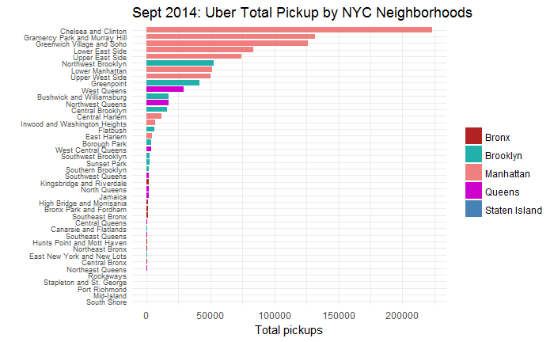
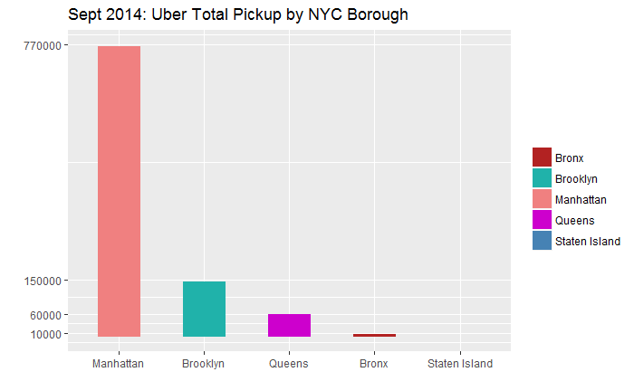
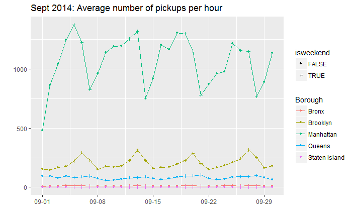
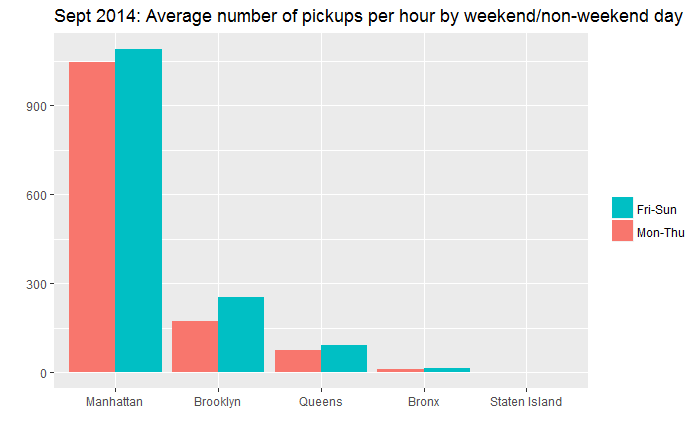
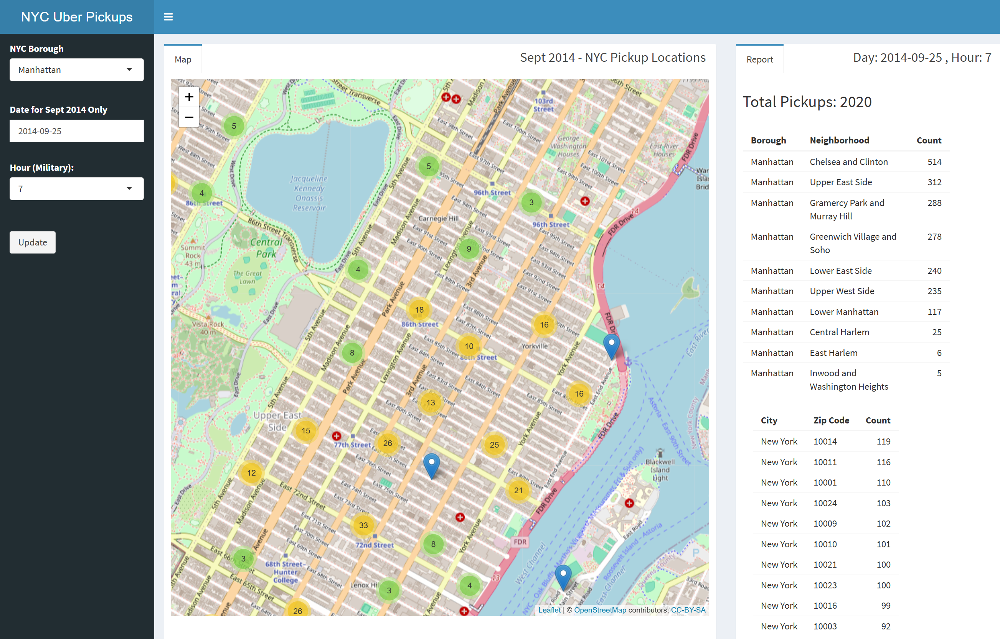

----

## September 2014 Uber Pickups in New York City

This project analyzes Uber pickup locations from September 2014, using a dataset from [Kaggle](https://www.kaggle.com/fivethirtyeight/uber-pickups-in-new-york-city/version/2). The analyzed dataset includes pickup date and time, along with corresponding latitude and longitude coordinates with more than one million rows. To gain deeper insights into ride activity and geographic trends, reverse geocoding was performed to map these coordinates to zip codes, borough, and neighborhood locations. The analysis also seeks to answer the questions listed below. 

In addition, this project presents an interactive Shiny app visualization for the September 2014 Uber pickup locations in New York City through Leaflet OpenStreetMap.

#### Questions 

- What is the distribution of pickups by neighborhoods in New York City?  
- What is the distribution of pickups by boroughs in New York City? 
- How does the average number of pickups per day change throughout the month? 
- Is there a difference in the average number of pickups per hour between weekend and non-weekend days? 

----

## Steps

1) Reverse geocoding
2) Process data to answer questions 
3) Perform hypothesis testing
4) Data visualization
5) Leaflet OpenStreetMap visualization in Shiny app 

----

## Reverse Geocoding 

The conversion of longitude and latitude geolocation points to zip codes presented several challenges when processing the Uber data. Initially, the `revgeo` package was used for reverse geocoding, but it proved to be slow and unreliable, with issues such as service access loss and R crashing.

To address these issues, a workaround was developed using the `zipcode` package, which contains a dataset of over 400,000 U.S. zip codes with corresponding longitude and latitude points. Because the pickup locations were arbitrary, a direct match between the geolocation points in the data and those in the zipcode package was not possible. To estimate the zip code, the distance between each pickup location and a list of known New York City zip codes was calculated, and the zip code with the minimum distance was selected. The `geosphere` package was used to calculate these distances.

Although this method was reliable, it was slow and limited by the computing power of the local computer. Processing one million rows took about 10 hours on a low-end laptop, making it impractical to process all 4.5 million rows of the 2014 Uber data set. Thus, the analysis was limited to the September 2014 data.

Upon investigation, some minimum distance results were suspicious, suggesting that some pickup locations were not in New York City. The revgeo package was used to confirm this.
To filter out these outliers, a maximum distance from the zip code geolocation was selected. Only pickup locations within 2000 meters (1.24 miles) of a zip code were included in the analysis. This resulted in the exclusion of 50,636 rows out of 1,028,136 rows processed.

The New York City zip codes used for comparison, along with their borough and neighborhood mappings, were sourced from the New York State Department of Health website, which listed 178 New York City zip codes.

https://www.health.ny.gov/statistics/cancer/registry/appendix/neighborhoods.htm

#### Examples of pickup locations that are not in New York City. 

The pickup locations shown below that were excluded show areas that are outside of New York City area (furthest) and areas that are close to the 2000 meter mark. As you can see, some pickup locations are in New Jersey that are close to NYC. 

The estimated zip code method isn't perfect, but it should be a reasonable estimate. The 2000 meter limit only excluded a small fraction of the total pickup locations (about 50,000 out of over 1 million locations). 

#### Distance furthest from zip code location. 

|pickup_datetime    | latitude| longitude|base   | location_index| distance|   zip|
|:------------------|--------:|---------:|:------|--------------:|--------:|-----:|
|9/16/2014 16:46:00 |  40.9231|  -72.7163|B02598 |             81| 86133.78| 11004|
|9/1/2014 16:32:00  |  40.9251|  -72.7339|B02617 |             81| 84742.13| 11004|
|9/27/2014 12:54:00 |  40.9567|  -72.7558|B02682 |             82| 83845.97| 11005|
|9/27/2014 11:05:00 |  40.8229|  -72.7480|B02617 |             81| 81649.66| 11004|
|9/17/2014 16:41:00 |  40.9362|  -72.8013|B02617 |             81| 79550.74| 11004|
|9/15/2014 11:30:00 |  40.9443|  -72.8178|B02598 |             82| 78447.18| 11005|
|9/8/2014 10:17:00  |  40.8034|  -72.8188|B02617 |             81| 75499.35| 11004|
|9/27/2014 11:20:00 |  40.7628|  -72.8388|B02617 |             81| 73567.25| 11004|
|9/27/2014 20:06:00 |  40.9280|  -72.8835|B02764 |             82| 72634.27| 11005|
|9/15/2014 15:05:00 |  40.8186|  -72.8606|B02617 |             81| 72154.06| 11004|

#### Reverse geocoding by `revgeo`. 

|city           |state      |zip      |
|:--------------|:----------|:--------|
|Calverton      |New York   |11933    |
|Calverton      |New York   |11933    |
|Baiting Hollow |New York   |11933    |
|East Moriches  |New York   |11940    |
|Wading River   |New York   |11933    |
|Wading River   |New York   |11961    |
|Moriches       |New York   |11949    |
|Mastic Beach   |New York   |11951    |
|East Shoreham  |New York   |11961    |
|Mastic         |New York   |11950    |

#### Distance closest to 2000 meters that are excluded. 

|pickup_datetime    | latitude| longitude|base   | location_index| distance|   zip|
|:------------------|--------:|---------:|:------|--------------:|--------:|-----:|
|9/18/2014 20:57:00 |  40.9179|  -73.8675|B02764 |             75| 2001.236| 10470|
|9/18/2014 21:00:00 |  40.9179|  -73.8675|B02764 |             75| 2001.236| 10470|
|9/20/2014 21:10:00 |  40.7311|  -73.6917|B02617 |             81| 2001.455| 11004|
|9/21/2014 16:26:00 |  40.7365|  -74.0289|B02617 |             13| 2001.620| 10014|
|9/21/2014 20:34:00 |  40.7365|  -74.0289|B02764 |             13| 2001.620| 10014|
|9/22/2014 10:52:00 |  40.7402|  -74.0279|B02617 |             13| 2002.089| 10014|
|9/13/2014 19:09:00 |  40.7402|  -74.0279|B02764 |             13| 2002.089| 10014|
|9/13/2014 19:09:00 |  40.7402|  -74.0279|B02764 |             13| 2002.089| 10014|
|9/16/2014 21:58:00 |  40.7397|  -74.0281|B02682 |             13| 2002.147| 10014|
|9/28/2014 4:07:00  |  40.7377|  -74.0287|B02598 |             13| 2002.473| 10014|

#### Reverse geolocation by `revgeo` 

|city           |state      |zip      |
|:--------------|:----------|:--------|
|City Not Found |New York   |10704    |
|City Not Found |New York   |10704    |
|New Hyde Park  |New York   |11001    |
|Jersey City    |New Jersey |07302    |
|Jersey City    |New Jersey |07302    |
|Hoboken        |New Jersey |07302    |
|Hoboken        |New Jersey |07302    |
|Hoboken        |New Jersey |07302    |
|Hoboken        |New Jersey |07302    |
|Jersey City    |New Jersey |07302    |


----

## Distribution of pickups by New York City Neighborhoods

{width=110%}

This shows the total number of pickups for each neighborhoods during the month of September 2014. As you can see, the top five neighborhoods are in Manhattan. Bronx and Staten Island neighborhoods are towards the bottom. 

----

## Distribution of pickups by New York City Boroughs

{width=100%}

This shows the total number of pickups for each New York City borough for the month of September 2014. As you can see, Manhattan takes the number one spot, and distantly followed by Brooklyn and Queens. Bronx and Staten Island pickups lag behind considerably. 

----

## Average Number of Pickups per hour for each day

{width=100%}

This shows the average number of pickups per hour for each day for the month of September 2014. As you can see, there appears to be a general pattern that repeats. There are certain days when the average number of pickups per hour increases. For example, for Brooklyn there seems to be a spike on Saturdays. 

----

## Average Number of Pickups per hour by wekeend/non-weekend day 

{width=100%}

This shows a side by side comparison of the average number of pickups per hour for weekend and non-weekend days for each borough. A weekend day is defined as a day that falls on Friday through Sunday. A non-weekend day is defined as a day that falls on Mon through Thursday. 

As you can see, there is a general pattern that shows the average number of pickups per hour seems to be higher on weekends. A hypothesis test is performed to determine if this difference is significant for each borough. 

----

## Hypothesis Test

A null hypothesis test was done to determine if the average number of pickups per hour between weekend and non-weekend days are different for each of the five boroughs in New York City. 

<b>H0:</b> There is no difference in the average number of pickups per hour between weekend and non-weekend days.

<b>HA:</b> There is a difference in the average number of pickups per hour between weekend and non-weekend days. 

The test was performed at the 95% significance level. 

- `mean1` refers to the weekend average number of pickups per hour. 
- `mean2` refers to the non-weekend average number of pickups per hour. 


|Borough       |       mean1|       mean2|  n1|  n2|         sd1|         sd2|      diff|    SE_diff|    T_score|   p_value|result              |
|:-------------|-----------:|-----------:|---:|---:|-----------:|-----------:|---------:|----------:|----------:|---------:|:-------------------|
|Bronx         |   12.607639|   10.686461| 288| 421|   7.1364655|   6.8300130|  1.921178|  0.5363233|  3.5821267| 0.0005733|Reject null         |
|Brooklyn      |  253.572917|  170.617169| 288| 431| 116.8397227|  71.8108276| 82.955747|  7.7049228| 10.7665903| 0.0000000|Reject null         |
|Manhattan     | 1089.618056| 1044.199536| 288| 431| 655.1839223| 638.3763540| 45.418520| 49.3562461|  0.9202183| 0.3601255|Fail to reject null |
|Queens        |   90.562500|   75.696056| 288| 431|  48.1478152|  43.4299538| 14.866444|  3.5249952|  4.2174368| 0.0000627|Reject null         |
|Staten Island |    1.361446|    1.237624|  83| 101|   0.6910281|   0.5319495|  0.123822|  0.0924929|  1.3387192| 0.1843174|Fail to reject null |

As you can see, for <b>Bronx</b>, <b>Brooklyn</b>, and <b>Queens</b> the p-values are below .05. For these boroughs, there is a statistically significant difference in the average number of pickups per hour between weekend and non-weekend days. 

|Borough  |   p_value|result      |
|:--------|---------:|:-----------|
|Bronx    | 0.0005733|Reject null |
|Brooklyn | 0.0000000|Reject null |
|Queens   | 0.0000627|Reject null |

For <b>Manhattan</b> and <b>Staten Island</b> the p-values are above .05. For these boroughs, there is no statistically significant difference in the average number of pickups per hour between weekend and non-weekend days. 

|Borough       |   p_value|result              |
|:-------------|---------:|:-------------------|
|Manhattan     | 0.3601255|Fail to reject null |
|Staten Island | 0.1843174|Fail to reject null |

----

### Start of Process File

----

### File locations 

`file_NYC_zipcodes`
- This is taken from https://www.health.ny.gov/statistics/cancer/registry/appendix/neighborhoods.htm. 
- This is a list of 178 zip codes with neighborhood and borough descriptions. 

`file_sept2014`
- This is taken from https://www.kaggle.com/fivethirtyeight/uber-pickups-in-new-york-city/version/2. 
- This is a list of Uber pickups for the month of September 2014 only. 
- This file has 1,028,136 observations. 


```r
file_NYC_zipcodes <- "https://raw.githubusercontent.com/Shetura36/Data-607-Assignments/master/FinalProject/NYC-ZipCodes-Borough.csv"
file_sept2014 = "https://raw.githubusercontent.com/Shetura36/Data-607-Assignments/master/FinalProject/uber-raw-data-sep14.csv"
file_reverseGeo_output <- "https://raw.githubusercontent.com/Shetura36/Data-607-Assignments/master/FinalProject/Pickup_Zipcodes.csv"
```

### Load libraries

```r
library(tidyverse)
library(revgeo)
library(zipcode)
library(geosphere)
library(knitr)
library(lubridate)
library(scales)
```

### Load data 

The code below loads the data from the file sources mentioned above into objects. 

The data file `zipcode` is from the `zipcode` package. This file contains over 400,000 zip codes in the United States that maps each zip code to a longitude and latitude geolocation point. 


```r
col_names <- c("pickup_datetime", "latitude", "longitude", "base")
pickup_sept2014 <- readr::read_csv(file_sept2014, skip = 1, col_names)
```

```
## Parsed with column specification:
## cols(
##   pickup_datetime = col_character(),
##   latitude = col_double(),
##   longitude = col_double(),
##   base = col_character()
## )
```

```r
NYC_zipcodes <- readr::read_csv(file_NYC_zipcodes)
```

```
## Parsed with column specification:
## cols(
##   Borough = col_character(),
##   Neighborhood = col_character(),
##   zip1 = col_integer(),
##   zip2 = col_integer(),
##   zip3 = col_integer(),
##   zip4 = col_integer(),
##   zip5 = col_integer(),
##   zip6 = col_integer(),
##   zip7 = col_integer(),
##   zip8 = col_integer(),
##   zip9 = col_integer()
## )
```

```r
#data from `zipcode` package
data(zipcode)
```

----

## Start of Reverse Geocoding Work 

----

### Transform NYC zip code file

The code below transforms the NYC zip code table so that it follows the tidy format. As a result of the data transformation, some of the cases will be incomplete. These incomplete cases are going to dropped. 

There are 178 NYC zip codes mapped to specific borough and neighborhoods. 


```r
#columns 3 through 11 are zip codes with labels zip1 through zip9
NYC_zipcodes <- tidyr::gather(NYC_zipcodes, "zipcodelabels", "zip", 3:11)
#only keep complete cases
NYC_zipcodes <- NYC_zipcodes[complete.cases(NYC_zipcodes),]
#drop "zipcodelabels" column
NYC_zipcodes$zipcodelabels <- NULL
#number of observations
#nrow(NYC_zipcodes)
```

### Join `zipcode` data with NYC zipcode

The code below joins `NYC_zipcodes` with `zipcode`. The `zipcode` data frame contains zip with mappings to longitude and latitude data. Because we are only looking at NYC geolocations, the reduced list would help improve performance in terms of estimating zip code mapping for the arbitrary Uber pick up locations. 

The resulting join has the expected 178 rows. 


```r
NYC_zipcodes$zip <- as.character(NYC_zipcodes$zip)
NYC_zipcodes_geolocation <- dplyr::inner_join(zipcode, NYC_zipcodes, by = "zip")
#nrow(NYC_zipcodes_geolocation)
#View(NYC_zipcodes_geolocation)
```

### About mapping geolocations to zip code, borough, and neighborhood name

The `revgeo` reverse geocoding (of the revgeo package) function was first used to try and map longitude and latitude data to zip code. The first attempt was with over 1 million records from the September 2014 file. The reverse geocoding halted with an error, and my IP address seemed like it was temporarily banned from using the service for about an hour. I then attempted to process only the first 100,000 records, but this crashed R. 

An example of retrieving the zip code from the `revgeo` function is `revgeo(longitude=-77.0229529, latitude=38.89283435, output='hash', item='zip')`. 

A workaround is to use the `zipcode` package, which contains over 400,000 zip codes in the United States. This package maps zip codes to longitude and latitude. As a reasonable estimate, the arbitrary pick up locations are mapped to the closest zip code. 


### Function definition for `getZipEstimate`

The function below takes a `pickup` geolocation and determines the minimum distance in the 178 zip codes in NYC. The Uber pickup locations are only for New York City. The 'geosphere::distm' function is used to calculate the distance. 

The output includes both the estimated zip code and the distance (in meters) of the pickup location to the published geolocation of the zip code. 

Pickup:   a vector of (longitude, latitude)
Returns:  a vector of (index, distance, zip)

The 'index' returned is the index of the zip to geolocation mapping in the `NYC_zipcodes_geolocation` data frame. 


```r
getZipEstimate <- function(pickup){
  #pickup <- c(-73.9549,40.769)
  distance <- vector(mode="double", length=nrow(NYC_zipcodes_geolocation))
  for(j in 1:nrow(NYC_zipcodes_geolocation)){
    distance[j] <- 
      geosphere::distm(c(NYC_zipcodes_geolocation$longitude[j], NYC_zipcodes_geolocation$latitude[j]), pickup)[1]
  }
  df_return <- cbind.data.frame(which.min(distance)[1],min(distance)[1],
         NYC_zipcodes_geolocation$zip[which.min(distance)[1]])
  colnames(df_return) <- c("index", "distance", "zip")
  return(df_return)
}
```

### Define function `processZipEstimate` and `writeToFile`

This is an estimate of the zip code area of the arbitrary pickup geolocation. As mentioned earlier, the `revgeo` reverse geocoding function would take a long time to map over 1 million points to zip codes. I also was temporarily blocked for a few hours after my first attempt of trying to process all over 1 millions observations. Including a sleep function would further slow down the conversion. In addition, the attempt to process 100,000 rows crashed R after waiting for about 1.5 hours.

The workaround is to estimate the zip code area based on the 178 zip codes in the `NYC_zipcodes_geologication` data frame. These are zip codes in New York City within the 5 boroughs as published by New York State Department of Heath. 

https://www.health.ny.gov/statistics/cancer/registry/appendix/neighborhoods.htm

The assumption is that pickup locations are mostly (if not all) in New York City and should fall within the 178 zip code geolocations. 

NEED FOR MPROVEMENT: Determine a faster way to convert geolocation to zip code or use big data technology to do the conversion like Spark. 

The function `processZipEstimate` is going to be called by the batch processing code. 

The function `writeToFile` is a convenience function that will help incrementally build the output. 


```r
#Write zip code estimate to CSV file
writeToFile <- function(theData, start, end, filename){
  write.csv(theData[start:end,], file=filename)
}

#define function
processZipEstimate <- function(data,start,end,filename){
  for(j in start:end){
    #feedback batch starts
    if(j==start)
      print(paste("Start processing ", filename))
    pickup <- c(data$longitude[j], data$latitude[j])
    estimate <- getZipEstimate(pickup)
    #print(estimate)
    data$location_index[j] <- estimate$index
    data$distance[j] <- estimate$distance
    data$zip[j] <- as.character(estimate$zip)
    #feedback every 1000 rows completed
    if(j%%1000==0)
      print(j)
  }
  writeToFile(data,start,end,filename)
  #feedback batch ends
  print(paste("End processing ", filename))
}
```

### Batch process for mapping to zip code, borough, neighborhood

The conversion code below takes about 1 hour to process 100,000 rows. The function `getZipEstimate` takes the pickup location goes through each of the 178 zip code locations and calculates the distance. It then selects the zip code with the minimum distance. So it took about 10 hours to process 1 million rows. 

The code below is designed to generate 10 batch files broken down into 100,000 rows plus 1 remainder file that is less than 100,000 rows. The smaller batch output would allow me to restart the conversion after the last successful batch should R crash or just stop working. I can comment out the batches that completed okay. 

The batch calls are commented out below because I already have these files, and this would take many hours to run. Because this is a local process, the time it takes to complete this process depends on the computing power of the computer used. It took me about 10 hours to process a little over 1 million rows with my low-end Dell home laptop. 


```r
data_pickup <- pickup_sept2014
#create new column and initialize
data_pickup$location_index[1] <- -100 
data_pickup$distance[1] <- 999999
data_pickup$zip[1] <- "zip"

#processZipEstimate(data_pickup, 1, 100000, "batch-01.csv")
#processZipEstimate(data_pickup, 100001, 200000, "batch-02.csv")
#processZipEstimate(data_pickup, 200001, 300000, "batch-03.csv")
#processZipEstimate(data_pickup, 300001, 400000, "batch-04.csv")
#processZipEstimate(data_pickup, 400001, 500000, "batch-05.csv")
#processZipEstimate(data_pickup, 500001, 600000, "batch-06.csv")
#processZipEstimate(data_pickup, 600001, 700000, "batch-07.csv")
#processZipEstimate(data_pickup, 700001, 800000, "batch-08.csv")
#processZipEstimate(data_pickup, 800001, 900000, "batch-09.csv")
#processZipEstimate(data_pickup, 900001, 1000000, "batch-10.csv")
#processZipEstimate(data_pickup, 1000001,nrow(data), "batch-11.csv")
```

### Build complete reverse geolocation file 

The code below is commented out because the batch files were already combined.

If you wish to rebuild the reverse geolocation output, the output files are found in github links below. You could also choose to run the batch process code above and rebuild each incremental files. 


```r
#original batch outputs for reverse geolocation: 
#"data_1_100000.csv"
#"data_100001_247138.csv"
#"data_247139_633834.csv"
#"data_633835_1028136.csv"

#Same output files in Github: 
p1 <- "https://raw.githubusercontent.com/Shetura36/Data-607-Assignments/master/FinalProject/data_1_100000.csv" 
p2 <- "https://raw.githubusercontent.com/Shetura36/Data-607-Assignments/master/FinalProject/data_100001_247138.csv" 
p3 <- "https://raw.githubusercontent.com/Shetura36/Data-607-Assignments/master/FinalProject/data_247139_633834.csv"  
p4 <- "https://raw.githubusercontent.com/Shetura36/Data-607-Assignments/master/FinalProject/data_633835_1028136.csv"

#Code below commented out: uncommented to rebuild 
#p1 <- readr::read_csv(p1)
#p2 <- readr::read_csv(p2)
#p3 <- readr::read_csv(p3)
#p4 <- readr::read_csv(p4)

#pickup_zipcode <- rbind(p1,p2,p3,p4)
#comment: remove the row numbers that were automatically added to the batch files. 
#pickup_zipcode$X1 <- NULL
#writeToFile(pickup_zipcode, 1, nrow(pickup_zipcode), "Pickup_Zipcodes.csv")
```

----

## Analysis of distance from zip code location starts here 

----

### Load reverse geolocation data

Expected number of rows: 1,028,136

COLUMNS

- pickup_datetime: pickup date and time (read as character)
- latitude: geolocation of pickup (read as double)
- longitude: geolocation of pickup (read as double)
- base: Uber base
- location_index: index of matching zip code in `NYC_zipcode_geolocation`. 
- distance: distance of pickup geolocation from zip code geolocation. 
- zip: closest zip code by geolocation point among the 178 NYC zip codes in `NYC_zipcode_geolocation`. 


```r
pickup_info<- readr::read_csv(file_reverseGeo_output)
pickup_info$X1 <- NULL
#number of rows
#nrow(pickup_info)
#incomplete cases: should be zero
#nrow(pickup_info[complete.cases(pickup_info)==FALSE,])
#rows with unfetched zip codes
#nrow(pickup_info[pickup_info$zip=="zip",])
```

### Preview of reverse geolocation data


```r
kable(head(pickup_info), format="markdown")
```


|pickup_datetime  | latitude| longitude|base   | location_index|   distance|   zip|
|:----------------|--------:|---------:|:------|--------------:|----------:|-----:|
|9/1/2014 0:01:00 |  40.2201|  -74.0021|B02512 |             50| 38021.8724| 10307|
|9/1/2014 0:01:00 |  40.7500|  -74.0027|B02512 |              1|   527.5424| 10001|
|9/1/2014 0:03:00 |  40.7559|  -73.9864|B02512 |             34|   513.0534| 10036|
|9/1/2014 0:06:00 |  40.7450|  -73.9889|B02512 |              9|   880.5894| 10010|
|9/1/2014 0:11:00 |  40.8145|  -73.9444|B02512 |             28|   412.3393| 10030|
|9/1/2014 0:12:00 |  40.6735|  -73.9918|B02512 |            102|   847.0934| 11215|

### Remove observations too far from zip code geolocation

The estimated zip code is selected from the list of 178 NYC zip codes based on shortest distance; however, some of the shortest distance is too far from the zip code. I noticed that some of the pickup geolocations are actually in NJ. As a reasonable zip code estimate, I've chosen a distance of no more than 2000 meters or around 1.24 miles from the zip code geolocation. 

The code below will remove rows that are more than 2000 meters. 

<b>50,636</b> rows were removed from 1,028,136 pickup locations. 


```r
pickup_info_far <- pickup_info[pickup_info$distance >= 2001,]
pickup_info_nyc <- pickup_info[pickup_info$distance < 2001,]
```

#### Number of pickups that are more than 2000 meters from the zip code geolocation. 


```r
nrow(pickup_info_far) 
```

```
## [1] 50636
```

```r
summary(pickup_info_far$distance)
```

```
##    Min. 1st Qu.  Median    Mean 3rd Qu.    Max. 
##    2001    3129    3443    6146    6951   86134
```

#### Define functions to retrieve location information 

The function below uses `revgeo` function for reverse geocoding. This is going to be used to investigate some of the pickup locations that were excluded because they are more than 2000 meters from the zip code location. 


```r
#function 1:
getrevgeo <- function(pickup){
  temp <- capture.output(info <- revgeo(longitude=pickup[1], latitude=pickup[2], output='hash'))
  df_return <- cbind.data.frame(info$city, info$state, info$zip)
  return(df_return)
}
#function 2: 
reverse_geo <- function(size, check){
  for(i in 1:size){
    pickup <- c(check$longitude[i], check$latitude[i])
    far <- getrevgeo(pickup)
    if(i==1)
      set <- far
    else
      set <- rbind.data.frame(set,far)
  }
  return(set)
}
```

#### Examples of pickup geolocations that are too far from the zip code geolocations

Below is a list of the top 10 locations that are furthest from the zip code locations. As you can these, these are locations that are not in New York City area. 

```r
pickup_info_far_top  <- dplyr::arrange(pickup_info_far, desc(distance))
pickup_info_far_bottom <- dplyr::arrange(pickup_info_far, distance)

kable(head(pickup_info_far_top,10), format="markdown")
```


|pickup_datetime    | latitude| longitude|base   | location_index| distance|   zip|
|:------------------|--------:|---------:|:------|--------------:|--------:|-----:|
|9/16/2014 16:46:00 |  40.9231|  -72.7163|B02598 |             81| 86133.78| 11004|
|9/1/2014 16:32:00  |  40.9251|  -72.7339|B02617 |             81| 84742.13| 11004|
|9/27/2014 12:54:00 |  40.9567|  -72.7558|B02682 |             82| 83845.97| 11005|
|9/27/2014 11:05:00 |  40.8229|  -72.7480|B02617 |             81| 81649.66| 11004|
|9/17/2014 16:41:00 |  40.9362|  -72.8013|B02617 |             81| 79550.74| 11004|
|9/15/2014 11:30:00 |  40.9443|  -72.8178|B02598 |             82| 78447.18| 11005|
|9/8/2014 10:17:00  |  40.8034|  -72.8188|B02617 |             81| 75499.35| 11004|
|9/27/2014 11:20:00 |  40.7628|  -72.8388|B02617 |             81| 73567.25| 11004|
|9/27/2014 20:06:00 |  40.9280|  -72.8835|B02764 |             82| 72634.27| 11005|
|9/15/2014 15:05:00 |  40.8186|  -72.8606|B02617 |             81| 72154.06| 11004|

```r
kable(head(pickup_info_far_bottom,10), format="markdown")
```


|pickup_datetime    | latitude| longitude|base   | location_index| distance|   zip|
|:------------------|--------:|---------:|:------|--------------:|--------:|-----:|
|9/18/2014 20:57:00 |  40.9179|  -73.8675|B02764 |             75| 2001.236| 10470|
|9/18/2014 21:00:00 |  40.9179|  -73.8675|B02764 |             75| 2001.236| 10470|
|9/20/2014 21:10:00 |  40.7311|  -73.6917|B02617 |             81| 2001.455| 11004|
|9/21/2014 16:26:00 |  40.7365|  -74.0289|B02617 |             13| 2001.620| 10014|
|9/21/2014 20:34:00 |  40.7365|  -74.0289|B02764 |             13| 2001.620| 10014|
|9/22/2014 10:52:00 |  40.7402|  -74.0279|B02617 |             13| 2002.089| 10014|
|9/13/2014 19:09:00 |  40.7402|  -74.0279|B02764 |             13| 2002.089| 10014|
|9/13/2014 19:09:00 |  40.7402|  -74.0279|B02764 |             13| 2002.089| 10014|
|9/16/2014 21:58:00 |  40.7397|  -74.0281|B02682 |             13| 2002.147| 10014|
|9/28/2014 4:07:00  |  40.7377|  -74.0287|B02598 |             13| 2002.473| 10014|

#### Use `revgeo` to get location of pickup locations that are more than 2000 meters from the zip code geolocation. 


```r
kable(reverse_geo(10, pickup_info_far_top), format="markdown")
```


|info$city      |info$state |info$zip |
|:--------------|:----------|:--------|
|Calverton      |New York   |11933    |
|Calverton      |New York   |11933    |
|Baiting Hollow |New York   |11933    |
|East Moriches  |New York   |11940    |
|Wading River   |New York   |11933    |
|Wading River   |New York   |11961    |
|Moriches       |New York   |11949    |
|Mastic Beach   |New York   |11951    |
|East Shoreham  |New York   |11961    |
|Mastic         |New York   |11950    |

```r
kable(reverse_geo(10, pickup_info_far_bottom), format="markdown")
```


|info$city      |info$state |info$zip |
|:--------------|:----------|:--------|
|City Not Found |New York   |10704    |
|City Not Found |New York   |10704    |
|New Hyde Park  |New York   |11001    |
|Jersey City    |New Jersey |07302    |
|Jersey City    |New Jersey |07302    |
|Hoboken        |New Jersey |07302    |
|Hoboken        |New Jersey |07302    |
|Hoboken        |New Jersey |07302    |
|Hoboken        |New Jersey |07302    |
|Jersey City    |New Jersey |07302    |

#### Join the zip code/borough/neighborhood information with the NYC pickup locations

The code below joins the borough and neighborhood information with the reverse geolocation output. 


```r
pickup_info_nyc$zip <- as.character(pickup_info_nyc$zip)
pickup_nyc <- dplyr::inner_join(NYC_zipcodes_geolocation, pickup_info_nyc, by = "zip")
#nrow(pickup_nyc)==nrow(pickup_info_nyc)
```

#### Preview NYC pickup locations

Below is preview of the pickup locations with the borough, neighborhood, and zip code information. 


```r
kable(head(pickup_nyc[,c(1,6,7,8,9,10)]), format="markdown")
```


|zip   |Borough   |Neighborhood        |pickup_datetime   | latitude.y| longitude.y|
|:-----|:---------|:-------------------|:-----------------|----------:|-----------:|
|10001 |Manhattan |Chelsea and Clinton |9/1/2014 0:01:00  |    40.7500|    -74.0027|
|10001 |Manhattan |Chelsea and Clinton |9/1/2014 2:41:00  |    40.7494|    -73.9946|
|10001 |Manhattan |Chelsea and Clinton |9/1/2014 3:18:00  |    40.7529|    -74.0040|
|10001 |Manhattan |Chelsea and Clinton |9/1/2014 5:45:00  |    40.7501|    -74.0025|
|10001 |Manhattan |Chelsea and Clinton |9/1/2014 8:57:00  |    40.7459|    -73.9883|
|10001 |Manhattan |Chelsea and Clinton |9/1/2014 11:57:00 |    40.7502|    -73.9947|

----

## Analysis of data starts here 

----

#### Define function for weekend

This is a helper function that determines if a day is a weekend or not. 
A weekend is defined as a day that falls on a Friday, Saturday, or Sunday. 


```r
isWeekend <- function(weekday_abbr){
  if(weekday_abbr =="Sun" | weekday_abbr == "Sat" | weekday_abbr == "Fri"){return(TRUE)}
  return(FALSE)
}
```

#### Add hour, weekday, isWeekend columns to `pickup_nyc` data frame

We will be looking at the count of pickup by borough/neighborhood, time of day, and day of week. 

By default, the pickup date time is read as a `character`. The code below will parse the date/time `character` as a date/time object. 


```r
pickup_nyc$pickup_datetime <- parse_datetime(pickup_nyc$pickup_datetime, "%m/%d/%Y %H:%M:%S")
pickup_nyc$date <- lubridate::date(pickup_nyc$pickup_datetime)
pickup_nyc$hour <- lubridate::hour(pickup_nyc$pickup_datetime)
pickup_nyc$weekday <- 
  wday(pickup_nyc$pickup_datetime, label = TRUE, abbr = TRUE, 
       week_start = getOption("lubridate.week.start", 7), locale = Sys.getlocale("LC_TIME"))
pickup_nyc$isWeekend <- sapply(levels(pickup_nyc$weekday)[pickup_nyc$weekday],isWeekend)
pickup_nyc$Borough <- as.factor(pickup_nyc$Borough)
#View(pickup_nyc[1:10,])
```

### Total count of pickup by Neighborhood and Borough


```r
neighborhood_count <- as.data.frame(dplyr::count(pickup_nyc, Borough, Neighborhood) %>% dplyr::arrange(desc(n)))
borough_count <- as.data.frame(dplyr::count(pickup_nyc, Borough) %>% dplyr::arrange(desc(n)))
kable(head(neighborhood_count), format="markdown")
```


|Borough   |Neighborhood                  |      n|
|:---------|:-----------------------------|------:|
|Manhattan |Chelsea and Clinton           | 223194|
|Manhattan |Gramercy Park and Murray Hill | 131927|
|Manhattan |Greenwich Village and Soho    | 125944|
|Manhattan |Lower East Side               |  83527|
|Manhattan |Upper East Side               |  74349|
|Brooklyn  |Northwest Brooklyn            |  52508|

```r
kable(borough_count, format="markdown")
```


|Borough       |      n|
|:-------------|------:|
|Manhattan     | 763860|
|Brooklyn      | 146565|
|Queens        |  58707|
|Bronx         |   8130|
|Staten Island |    238|

### Pickup count for each hour of each day by Borough


```r
borough_day_hour_count <- 
  as.data.frame(dplyr::count(pickup_nyc, Borough, date, hour) %>% dplyr::arrange(desc(date,hour)))
#nrow(borough_day_hour_count) #3050
kable(head(borough_day_hour_count), format="markdown") 
```


|Borough |date       | hour|  n|
|:-------|:----------|----:|--:|
|Bronx   |2014-09-30 |    0|  8|
|Bronx   |2014-09-30 |    1|  4|
|Bronx   |2014-09-30 |    2|  3|
|Bronx   |2014-09-30 |    3|  4|
|Bronx   |2014-09-30 |    4|  5|
|Bronx   |2014-09-30 |    5|  9|

### Average hourly pickup per day by Borough


```r
borough_day_hour_avg <- 
borough_day_hour_count %>% dplyr::group_by(Borough, date) %>% dplyr::summarise(hour_avg=mean(n))
#preview
kable(head(borough_day_hour_avg), format="markdown")
```


|Borough |date       |  hour_avg|
|:-------|:----------|---------:|
|Bronx   |2014-09-01 |  7.086957|
|Bronx   |2014-09-02 | 10.125000|
|Bronx   |2014-09-03 | 11.045454|
|Bronx   |2014-09-04 | 12.695652|
|Bronx   |2014-09-05 | 12.791667|
|Bronx   |2014-09-06 | 13.500000|

### Average hourly pickup on weekend and non-weekend days by borough


```r
borough_day_hour_avg$weekday <- wday(borough_day_hour_avg$date, label = TRUE, abbr = TRUE, 
       week_start = getOption("lubridate.week.start", 7), locale = Sys.getlocale("LC_TIME"))
borough_day_hour_avg$isweekend <- sapply(levels(borough_day_hour_avg$weekday)[borough_day_hour_avg$weekday],isWeekend)
borough_isweekend_hour_avg <-
  borough_day_hour_avg %>% dplyr::group_by(Borough, isweekend) %>% dplyr::summarise(hour_avg=mean(hour_avg))
#preview
kable(borough_isweekend_hour_avg)
```


Borough         isweekend       hour_avg
--------------  ----------  ------------
Bronx           FALSE          10.687162
Bronx           TRUE           12.607639
Brooklyn        FALSE         170.639694
Brooklyn        TRUE          253.572917
Manhattan       FALSE        1044.418378
Manhattan       TRUE         1089.618056
Queens          FALSE          75.672605
Queens          TRUE           90.562500
Staten Island   FALSE           1.220282
Staten Island   TRUE            1.379810

### Hypothesis testing of average hourly pickups between weekend and non-weekend days 

This is a null hypothesis testing of the average number of pickups per hour between weekend and non-weekend days for each of the 5 boroughs in New York City. 

H0: There is no difference in the average number of pickups per hour between weekend and non-weekend days. 
HA: There is a difference in the average number of pickups per hour between weekend and non-weekend days. 

This test is performed at the 95% significance level. 


```r
#count of pickkups for each hour of the day for each borough
borough_day_hour_count <- as.data.frame(pickup_nyc %>% dplyr::count(Borough, date, hour))
#add weekday column:
borough_day_hour_count$weekday <- wday(borough_day_hour_count$date, label = TRUE, abbr = TRUE, 
       week_start = getOption("lubridate.week.start", 7), locale = Sys.getlocale("LC_TIME"))
#add isweekend column:
borough_day_hour_count$isweekend <- sapply(levels(borough_day_hour_count$weekday)[borough_day_hour_count$weekday],isWeekend)
#separate weekend and non-weekend pickups
weekend_data <- borough_day_hour_count %>%  dplyr::filter(isweekend==TRUE)
notweekend_data <- borough_day_hour_count %>% dplyr::filter(isweekend==FALSE)
#get standard deviations
weekend_sd <- weekend_data %>% dplyr::group_by(Borough) %>% summarise(sd1=sd(n))
notweekend_sd <- notweekend_data %>% dplyr::group_by(Borough) %>% summarise(sd2=sd(n))
#get count of observations
weekend_count <- weekend_data %>% dplyr::count(Borough)
notweekend_count <- notweekend_data %>% dplyr::count(Borough) 
colnames(weekend_count)[2] <- "n1"
colnames(notweekend_count)[2] <- "n2"
#get average no. of pickups per hour on weekend and non-weekend days
weekend_mean <- weekend_data %>% dplyr::group_by(Borough) %>% summarise(mean1=mean(n))
notweekend_mean <- notweekend_data %>% dplyr::group_by(Borough) %>% summarise(mean2=mean(n))
#prepare table of data for hypothesis testing
hypothesis_data <- 
dplyr::inner_join(weekend_mean, notweekend_mean, by = "Borough") %>% 
  dplyr::inner_join(weekend_count, by = "Borough") %>% 
   dplyr::inner_join(notweekend_count, by = "Borough") %>% 
    dplyr::inner_join(weekend_sd, by = "Borough") %>% 
      dplyr::inner_join(notweekend_sd, by = "Borough") 

#Calculate difference of means for each borough
hypothesis_data$diff <- hypothesis_data$mean1 - hypothesis_data$mean2
#calculate standard error for each borough
hypothesis_data$SE_diff <- sqrt((hypothesis_data$sd1^2)/hypothesis_data$n1 + (hypothesis_data$sd2^2)/hypothesis_data$n2)
#calculate t-score for each borough
hypothesis_data$T_score <- (hypothesis_data$diff - 0)/hypothesis_data$SE_diff
#calculate p-value for each borough
hypothesis_data$p_value <- (1-pt(abs(hypothesis_data$T_score),df=min(hypothesis_data$n1,hypothesis_data$n2-1)))*2
#function to classify result
getresult <- function(p_value){
  if(p_value < .05) return("Reject null")
  else return("Fail to reject null")
}
#get description of result 
hypothesis_data$result <- sapply(hypothesis_data$p_value, getresult)
```

#### Hypothesis testing results

Below is the result of the hypothesis test. 


|Borough       |       mean1|       mean2|  n1|  n2|         sd1|         sd2|      diff|    SE_diff|    T_score|   p_value|result              |
|:-------------|-----------:|-----------:|---:|---:|-----------:|-----------:|---------:|----------:|----------:|---------:|:-------------------|
|Bronx         |   12.607639|   10.686461| 288| 421|   7.1364655|   6.8300130|  1.921178|  0.5363233|  3.5821267| 0.0005733|Reject null         |
|Brooklyn      |  253.572917|  170.617169| 288| 431| 116.8397227|  71.8108276| 82.955747|  7.7049228| 10.7665903| 0.0000000|Reject null         |
|Manhattan     | 1089.618056| 1044.199536| 288| 431| 655.1839223| 638.3763540| 45.418520| 49.3562461|  0.9202183| 0.3601255|Fail to reject null |
|Queens        |   90.562500|   75.696056| 288| 431|  48.1478152|  43.4299538| 14.866444|  3.5249952|  4.2174368| 0.0000627|Reject null         |
|Staten Island |    1.361446|    1.237624|  83| 101|   0.6910281|   0.5319495|  0.123822|  0.0924929|  1.3387192| 0.1843174|Fail to reject null |

As you can see, for <b>Bronx</b>, <b>Brooklyn</b>, and <b>Queens</b> the p-values are below .05. For these boroughs, there is a statistically significant difference in the average number of pickups per hour between weekend and non-weekend days. 


|Borough  |   p_value|result      |
|:--------|---------:|:-----------|
|Bronx    | 0.0005733|Reject null |
|Brooklyn | 0.0000000|Reject null |
|Queens   | 0.0000627|Reject null |

For <b>Manhattan</b> and <b>Staten Island</b> the p-values are above .05. For these boroughs, there is no statistically significant difference in the average number of pickups per hour between weekend and non-weekend days. 


|Borough       |   p_value|result              |
|:-------------|---------:|:-------------------|
|Manhattan     | 0.3601255|Fail to reject null |
|Staten Island | 0.1843174|Fail to reject null |

----

## September 2014 NYC Uber Pickup Leaflet OpenStreetMap Visualization in Shiny App

To view the interactive Shiny app, please visit https://shetura36.shinyapps.io/Data608_Uber_Final_Project/
<br/> Click on the "Update" button to start displaying the pickup locations. 

[This](https://rpubs.com/Shetura36/Data608-FinalProject-PrepareData) describes the data preparation of the file that's used by the app. 

Below is a preview of the Shiny app. 

{width=80%}


