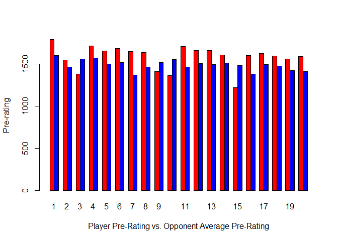
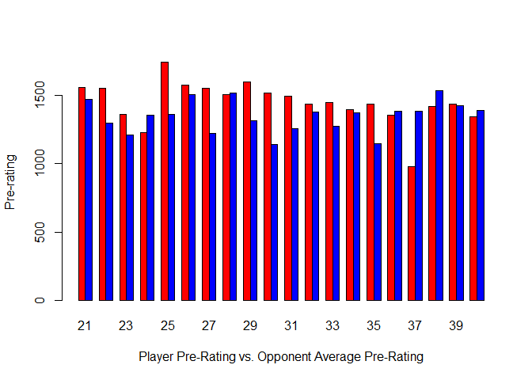
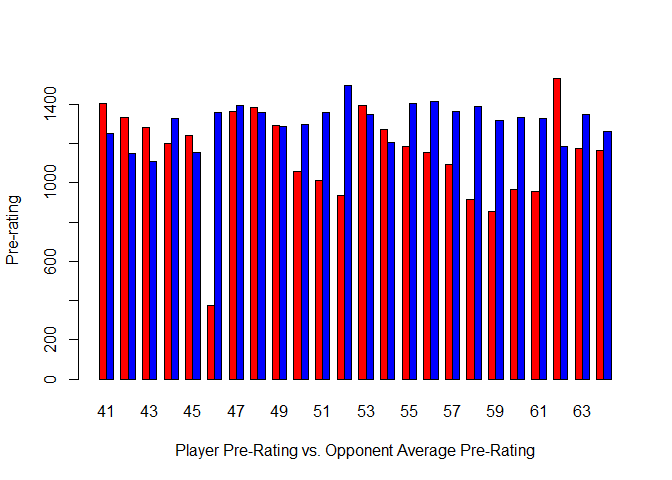
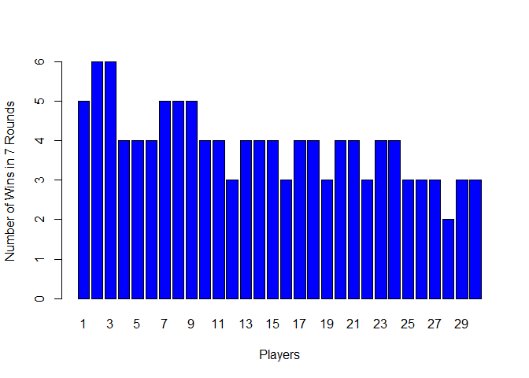
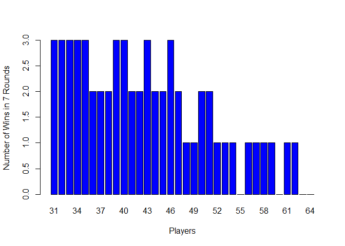

## Project 1
> 
In this project, you're given a text file with chess tournament results where the information has some structure. Your job is to create an R Markdown file that generates a .CSV file (that could for example be imported into a SQL database) with the following information for all of the players: <br />
>
* Player's Name
* Player's State
* Total Number of Points
* Player's Pre-Rating
* Average Pre Chess Rating of Opponents <br />
> 
#### Source File: <br />
https://raw.githubusercontent.com/Shetura36/Data-607-Assignments/master/Project1/tournamentinfo.txt
> 
* The file has 196 lines
* The file has 128 lines that contain player information
* The file has 64 individual players
>
#### Output File: <br />
Link to a CSV file generated by this R code that contains the player data extracted from the source file.
>
* https://github.com/Shetura36/Data-607-Assignments/blob/master/Project1/project1-output.csv  
* https://raw.githubusercontent.com/Shetura36/Data-607-Assignments/master/Project1/project1-output.csv   (raw file)


------------------------------------------------
------------------------------------------------

### Load Libraries

```r
library(RCurl)
library(stringr)
```

------------------------------------------------
------------------------------------------------

### Prepare Data Frame
> 
* Read file
* Load data as a data frame
* Convert data type of each line from factor to character


```r
fileURL = "https://raw.githubusercontent.com/Shetura36/Data-607-Assignments/master/Project1/tournamentinfo.txt"
textFile <- readLines(fileURL)
typeof(textFile) #array of character
```

```
## [1] "character"
```

```r
df.textData <- as.data.frame(textFile)#convert textFile into a data frame
dim(df.textData) # has 196 lines
```

```
## [1] 196   1
```

```r
df.textData$textFile <- as.character(df.textData$textFile) #convert factor data into character data
head(df.textData)
```

```
##                                                                                     textFile
## 1  -----------------------------------------------------------------------------------------
## 2  Pair | Player Name                     |Total|Round|Round|Round|Round|Round|Round|Round| 
## 3  Num  | USCF ID / Rtg (Pre->Post)       | Pts |  1  |  2  |  3  |  4  |  5  |  6  |  7  | 
## 4  -----------------------------------------------------------------------------------------
## 5      1 | GARY HUA                        |6.0  |W  39|W  21|W  18|W  14|W   7|D  12|D   4|
## 6     ON | 15445895 / R: 1794   ->1817     |N:2  |W    |B    |W    |B    |W    |B    |W    |
```

```r
tail(df.textData)
```

```
##                                                                                      textFile
## 191    63 | THOMAS JOSEPH HOSMER            |1.0  |L   2|L  48|D  49|L  43|L  45|H    |U    |
## 192    MI | 15057092 / R: 1175   ->1125     |     |W    |B    |W    |B    |B    |     |     |
## 193 -----------------------------------------------------------------------------------------
## 194    64 | BEN LI                          |1.0  |L  22|D  30|L  31|D  49|L  46|L  42|L  54|
## 195    MI | 15006561 / R: 1163   ->1112     |     |B    |W    |W    |B    |W    |B    |B    |
## 196 -----------------------------------------------------------------------------------------
```

------------------------------------------------
------------------------------------------------

## Define Functions

###  (1) Function: isPlayerData
> 
This function helps identify which lines of text contain player data and which lines don't. 
>
Assumption: <br/>
Every player data line either starts with a number or a 2 letter abbreviation of a state. This assumption is true for this specific file. <br /><br />
Returns TRUE if line either starts with a 2 letter abbreviation or start with a number; otherwise return FALSE. 


```r
isPlayerData <- function(strData){
  return(str_detect(str_trim(strData), "^([0-9]{1,2})") | 
           str_detect(str_trim(strData), "^([A-Z]{2,2})"))
}
```

###  (2) Function: getRoundOutcome
> This will extra theh "outcome portion of a "round" token of a player


```r
getRoundOutcome <- function(roundData){
  return(unlist(sapply(roundData, str_extract, pattern = "^[A-Z]")))
}
```

### (3) Function: getRoundOpponent
> This will extract the "opponent" portion of a "round" token of a player. 


```r
getRoundOpponent <- function(roundData){
  unlist(sapply(roundData, str_extract, pattern = "[0-9]{1,2}$"))
}
```

### (4) Function: getPlayerPreRating
> This function returns a player's pre-rating. <br />
> This function takes a parameter called "prerating", and it expects this data frame to have a column called "playerID" and "pre_ratings"


```r
getPlayerPreRating <- function(thisPlayerID, preratings){
  
  if (is.na(thisPlayerID)) {return(NA)}
  else
  {
    thisSubset <- subset(playerPreRating, playerPreRating$playerID == thisPlayerID)
    return(thisSubset$pre_ratings)
  }
}
```

------------------------------------------------
------------------------------------------------

## Process Data
> Data to be extracted from the file:
> 
* Player's Name 
* Player's State 
* Total Number of Points
* Player's Pre-Rating
* Average Pre Chess Rating of opponents

------------------------------------------------

### Step 1: Identify if line contains player data or not.
>
* Add a logical column called "isPlayerData" to "df.textData". 
* This column will be TRUE if the line has player data and FALSE if the line does not have player data.
* The text file has 128 lines that contain player information.
* The text file has 64 individual players


```r
#We are adding a logical column isPlayerData: 
df.textData$isPlayerData <- sapply(df.textData$textFile, isPlayerData)

#Retrieve all lines identified to contain player data. 
playerLines <- subset(df.textData, df.textData$isPlayerData == TRUE)

#has 128 row of player data
dim(playerLines)
```

```
## [1] 128   2
```

------------------------------------------------

### Step 2: Identify odd and even player lines 
> 
The assumption here is each player in the file has two lines of data: an odd and even line. The purpose of this data processing is to collapse the odd and even lines for each player into a single row.


```r
#Get odd player lines
oddPlayerLines <- unlist(sapply(playerLines$textFile[seq(1, 128, 2)], str_trim))
names(oddPlayerLines) <- NULL

#64 odd player lines
length(oddPlayerLines)
```

```
## [1] 64
```

```r
#Get even player lines
evenPlayerLines <- unlist(sapply(playerLines$textFile[seq(2, 128, 2)], str_trim))
names(evenPlayerLines) <- NULL

#64 even player lines
length(evenPlayerLines) 
```

```
## [1] 64
```

```r
#Combine odd and even player lines as columns in a matrix. 
players <- cbind(oddPlayerLines, evenPlayerLines)

#Convert player as a data frame
players <- as.data.frame(players)

#Convert data type from factor to character
players$oddPlayerLines <- as.character(players$oddPlayerLines)
players$evenPlayerLines <- as.character(players$evenPlayerLines)

#64 rows with 2 columns
dim(players)
```

```
## [1] 64  2
```

```r
head(players)
```

```
##                                                                          oddPlayerLines
## 1 1 | GARY HUA                        |6.0  |W  39|W  21|W  18|W  14|W   7|D  12|D   4|
## 2 2 | DAKSHESH DARURI                 |6.0  |W  63|W  58|L   4|W  17|W  16|W  20|W   7|
## 3 3 | ADITYA BAJAJ                    |6.0  |L   8|W  61|W  25|W  21|W  11|W  13|W  12|
## 4 4 | PATRICK H SCHILLING             |5.5  |W  23|D  28|W   2|W  26|D   5|W  19|D   1|
## 5 5 | HANSHI ZUO                      |5.5  |W  45|W  37|D  12|D  13|D   4|W  14|W  17|
## 6 6 | HANSEN SONG                     |5.0  |W  34|D  29|L  11|W  35|D  10|W  27|W  21|
##                                                                          evenPlayerLines
## 1 ON | 15445895 / R: 1794   ->1817     |N:2  |W    |B    |W    |B    |W    |B    |W    |
## 2 MI | 14598900 / R: 1553   ->1663     |N:2  |B    |W    |B    |W    |B    |W    |B    |
## 3 MI | 14959604 / R: 1384   ->1640     |N:2  |W    |B    |W    |B    |W    |B    |W    |
## 4 MI | 12616049 / R: 1716   ->1744     |N:2  |W    |B    |W    |B    |W    |B    |B    |
## 5 MI | 14601533 / R: 1655   ->1690     |N:2  |B    |W    |B    |W    |B    |W    |B    |
## 6 OH | 15055204 / R: 1686   ->1687     |N:3  |W    |B    |W    |B    |B    |W    |B    |
```

------------------------------------------------

### Step 3: Extract atomic player information from "oddPlayerLine" column
> 
"Odd" player lines contain the following information: 
> 
* Player Id
* Player Name
* Total Points
* Outcome for each round
* Opponent for each round


```r
#Tokenize "odd" player line by breaking the line apart with the separator "|"
playerInfo <- unlist(sapply(players$oddPlayerLines, str_split, "\\|"))

#Convert to data frame
playerInfo <- as.data.frame(playerInfo)

#704 tokens
dim(playerInfo)
```

```
## [1] 704   1
```

```r
#Rename column
row.names(playerInfo) <- NULL
names(playerInfo) <- NULL
names(playerInfo) <- c("tokens")

head(playerInfo)
```

```
##                              tokens
## 1                                1 
## 2  GARY HUA                        
## 3                             6.0  
## 4                             W  39
## 5                             W  21
## 6                             W  18
```

```r
#Convert data type of tokens from factor to character
playerInfo$tokens <- as.character(playerInfo$tokens)

#Remove empty tokens
playerInfo <- subset(playerInfo, playerInfo$tokens != "")

#640 tokens after removing all empty tokens
dim(playerInfo)
```

```
## [1] 640   1
```

```r
#Each player's "odd" line has 10 attributes. 
#We are going to retrieve each attribute
playerID <- playerInfo$tokens[seq(1,640, 10)]
playerNames <- playerInfo$tokens[seq(2,640,10)]
totalPoints <- playerInfo$tokens[seq(3,640,10)]
Round1 <- playerInfo$tokens[seq(4,640,10)]
Round2 <- playerInfo$tokens[seq(5,640,10)]
Round3 <- playerInfo$tokens[seq(6,640,10)]
Round4 <- playerInfo$tokens[seq(7,640,10)]
Round5 <- playerInfo$tokens[seq(8,640,10)]
Round6 <- playerInfo$tokens[seq(9,640,10)]
Round7 <- playerInfo$tokens[seq(10,640,10)]
R1_outcome <- getRoundOutcome(Round1)
R1_opponent <- getRoundOpponent(Round1)
R2_outcome <- getRoundOutcome(Round2)
R2_opponent <- getRoundOpponent(Round2)
R3_outcome <- getRoundOutcome(Round3)
R3_opponent <- getRoundOpponent(Round3)
R4_outcome <- getRoundOutcome(Round4)
R4_opponent <- getRoundOpponent(Round4)
R5_outcome <- getRoundOutcome(Round5)
R5_opponent <- getRoundOpponent(Round5)
R6_outcome <- getRoundOutcome(Round6)
R6_opponent <- getRoundOpponent(Round6)
R7_outcome <- getRoundOutcome(Round7)
R7_opponent <- getRoundOpponent(Round7)

#check the tokens extracted
check <- cbind(playerID, playerNames, totalPoints, R1_opponent, R2_opponent, R3_opponent, R4_opponent, R5_opponent, R6_opponent, R7_opponent)
row.names(check) <- NULL
dim(check) #64 rows, 10 columns
```

```
## [1] 64 10
```

```r
head(check) 
```

```
##      playerID playerNames                         totalPoints R1_opponent
## [1,] "1 "     " GARY HUA                        " "6.0  "     "39"       
## [2,] "2 "     " DAKSHESH DARURI                 " "6.0  "     "63"       
## [3,] "3 "     " ADITYA BAJAJ                    " "6.0  "     "8"        
## [4,] "4 "     " PATRICK H SCHILLING             " "5.5  "     "23"       
## [5,] "5 "     " HANSHI ZUO                      " "5.5  "     "45"       
## [6,] "6 "     " HANSEN SONG                     " "5.0  "     "34"       
##      R2_opponent R3_opponent R4_opponent R5_opponent R6_opponent
## [1,] "21"        "18"        "14"        "7"         "12"       
## [2,] "58"        "4"         "17"        "16"        "20"       
## [3,] "61"        "25"        "21"        "11"        "13"       
## [4,] "28"        "2"         "26"        "5"         "19"       
## [5,] "37"        "12"        "13"        "4"         "14"       
## [6,] "29"        "11"        "35"        "10"        "27"       
##      R7_opponent
## [1,] "4"        
## [2,] "7"        
## [3,] "12"       
## [4,] "1"        
## [5,] "17"       
## [6,] "21"
```


------------------------------------------------

### Step 4: Extract atomic player information from "evenPlayerLine" column
>"Even" player lines contain the following information: 
> 
* State
* Pre_rating


```r
states <- unlist(sapply(players$evenPlayerLines, str_extract, pattern = "^[A-Z]{2,2}"))

pre_ratings_part1 <- unlist(sapply(players$evenPlayerLines, str_extract, pattern = "R:([ ]){1,}([0-9]){1,}"))

pre_ratings <- unlist(sapply(pre_ratings_part1, str_extract, pattern = "([0-9]){1,}"))

#check extraced data
check <- cbind(states, pre_ratings)
row.names(check) <- NULL
dim(check) #64 rows, 2 columns
```

```
## [1] 64  2
```

```r
head(check)
```

```
##      states pre_ratings
## [1,] "ON"   "1794"     
## [2,] "MI"   "1553"     
## [3,] "MI"   "1384"     
## [4,] "MI"   "1716"     
## [5,] "MI"   "1655"     
## [6,] "OH"   "1686"
```


------------------------------------------------

### Step 5: Build data frames for players
> Data frames: <br /> 
>
* playerInfo - contains playerID, playerNames, states
* playerOpponent - contains playerID, playerOpponent
* playerOutcome - contains playerID, playerOutcome
* playerTotalPoints - contains playerID, totalPoints
* playerPreRatings - contains playerID, pre_ratings


```r
playerInfo <- as.data.frame(cbind(playerID, playerNames, states))
row.names(playerInfo) <- NULL

playerOutcome <- as.data.frame(cbind(playerID, R1_outcome, R2_outcome, R3_outcome, R4_outcome, R5_outcome, R6_outcome, R7_outcome))
row.names(playerOutcome) <- NULL

playerOpponent <- as.data.frame(cbind(playerID, R1_opponent, R2_opponent, R3_opponent, R4_opponent, R5_opponent, R6_opponent, R7_opponent))
row.names(playerOpponent) <- NULL

playerPreRating <- as.data.frame(cbind(playerID, pre_ratings))
row.names(playerPreRating) <- NULL

playerTotalPoints <- as.data.frame(cbind(playerID, totalPoints))
row.names(playerTotalPoints) <- NULL

head(playerInfo)
```

```
##   playerID                       playerNames states
## 1       1   GARY HUA                             ON
## 2       2   DAKSHESH DARURI                      MI
## 3       3   ADITYA BAJAJ                         MI
## 4       4   PATRICK H SCHILLING                  MI
## 5       5   HANSHI ZUO                           MI
## 6       6   HANSEN SONG                          OH
```

```r
head(playerTotalPoints)
```

```
##   playerID totalPoints
## 1       1        6.0  
## 2       2        6.0  
## 3       3        6.0  
## 4       4        5.5  
## 5       5        5.5  
## 6       6        5.0
```

```r
head(playerPreRating)
```

```
##   playerID pre_ratings
## 1       1         1794
## 2       2         1553
## 3       3         1384
## 4       4         1716
## 5       5         1655
## 6       6         1686
```

```r
head(playerOpponent)
```

```
##   playerID R1_opponent R2_opponent R3_opponent R4_opponent R5_opponent
## 1       1           39          21          18          14           7
## 2       2           63          58           4          17          16
## 3       3            8          61          25          21          11
## 4       4           23          28           2          26           5
## 5       5           45          37          12          13           4
## 6       6           34          29          11          35          10
##   R6_opponent R7_opponent
## 1          12           4
## 2          20           7
## 3          13          12
## 4          19           1
## 5          14          17
## 6          27          21
```

```r
head(playerOutcome)
```

```
##   playerID R1_outcome R2_outcome R3_outcome R4_outcome R5_outcome
## 1       1           W          W          W          W          W
## 2       2           W          W          L          W          W
## 3       3           L          W          W          W          W
## 4       4           W          D          W          W          D
## 5       5           W          W          D          D          D
## 6       6           W          D          L          W          D
##   R6_outcome R7_outcome
## 1          D          D
## 2          W          W
## 3          W          W
## 4          W          D
## 5          W          W
## 6          W          W
```


------------------------------------------------

### Step 6: Convert to appropriate data types
> When a data frame is built, most of the variables are presented as factors. 
Towards the end of this project, I learned that I could set "stringsAsFactors=FALSE" to avoid the character data from being converted to factors automatically.<br />
>
* playerID --> numeric
* opponents --> numeric (since these refer to playerID's)
* totalPoints --> numeric
* pre_ratings --> numeric
* outcomes --> factors
* states --> factors
* playerNames --> factors


```r
#convert data type
playerInfo$playerID <- as.numeric(as.character(playerInfo$playerID))
playerInfo$states <- as.factor(playerInfo$states)

playerOutcome$playerID <- as.numeric(as.character(playerOutcome$playerID))
playerOutcome$R1_outcome <- as.factor(playerOutcome$R1_outcome)
playerOutcome$R2_outcome <- as.factor(playerOutcome$R2_outcome)
playerOutcome$R3_outcome <- as.factor(playerOutcome$R3_outcome)
playerOutcome$R4_outcome <- as.factor(playerOutcome$R4_outcome)
playerOutcome$R5_outcome <- as.factor(playerOutcome$R5_outcome)
playerOutcome$R6_outcome <- as.factor(playerOutcome$R6_outcome)
playerOutcome$R7_outcome <- as.factor(playerOutcome$R7_outcome)

playerOpponent$playerID <- as.numeric(as.character(playerOpponent$playerID))
playerOpponent$R1_opponent <- as.numeric(as.character(playerOpponent$R1_opponent))
playerOpponent$R2_opponent <- as.numeric(as.character(playerOpponent$R2_opponent))
playerOpponent$R3_opponent <- as.numeric(as.character(playerOpponent$R3_opponent))
playerOpponent$R4_opponent <- as.numeric(as.character(playerOpponent$R4_opponent))
playerOpponent$R5_opponent <- as.numeric(as.character(playerOpponent$R5_opponent))
playerOpponent$R6_opponent <- as.numeric(as.character(playerOpponent$R6_opponent))
playerOpponent$R7_opponent <- as.numeric(as.character(playerOpponent$R7_opponent))

playerPreRating$playerID <- as.numeric(as.character(playerPreRating$playerID))
playerPreRating$pre_ratings <- as.numeric(as.character(playerPreRating$pre_ratings))

playerTotalPoints$playerID <- as.numeric(as.character(playerTotalPoints$playerID))
playerTotalPoints$totalPoints <- as.numeric(as.character(playerTotalPoints$totalPoints))
```

------------------------------------------------

### Step 7: Calculate opponents' average pre-rating


```r
#Retrieve opponent's pre-rating scores
R1_opponentPreRatings <- unlist(sapply(playerOpponent$R1_opponent, getPlayerPreRating, preratings = playerPreRating))
R2_opponentPreRatings <- unlist(sapply(playerOpponent$R2_opponent, getPlayerPreRating, preratings = playerPreRating))
R3_opponentPreRatings <- unlist(sapply(playerOpponent$R3_opponent, getPlayerPreRating, preratings = playerPreRating))
R4_opponentPreRatings <- unlist(sapply(playerOpponent$R4_opponent, getPlayerPreRating, preratings = playerPreRating))
R5_opponentPreRatings <- unlist(sapply(playerOpponent$R5_opponent, getPlayerPreRating, preratings = playerPreRating))
R6_opponentPreRatings <- unlist(sapply(playerOpponent$R6_opponent, getPlayerPreRating, preratings = playerPreRating))
R7_opponentPreRatings <- unlist(sapply(playerOpponent$R7_opponent, getPlayerPreRating, preratings = playerPreRating))

#Build Matrix
opponentPreRatings <- cbind(R1_opponentPreRatings, R2_opponentPreRatings, R3_opponentPreRatings, R4_opponentPreRatings, R5_opponentPreRatings, R6_opponentPreRatings, R7_opponentPreRatings)

#Get the mean avarage pre rating scores of all oppponents for each player
opponentAverageRatings <- rowMeans(opponentPreRatings, na.rm = TRUE)

#Display 
opponentAverageRatings
```

```
##  [1] 1605.286 1469.286 1563.571 1573.571 1500.857 1518.714 1372.143
##  [8] 1468.429 1523.143 1554.143 1467.571 1506.167 1497.857 1515.000
## [15] 1483.857 1385.800 1498.571 1480.000 1426.286 1410.857 1470.429
## [22] 1300.333 1213.857 1357.000 1363.286 1506.857 1221.667 1522.143
## [29] 1313.500 1144.143 1259.857 1378.714 1276.857 1375.286 1149.714
## [36] 1388.167 1384.800 1539.167 1429.571 1390.571 1248.500 1149.857
## [43] 1106.571 1327.000 1152.000 1357.714 1392.000 1355.800 1285.800
## [50] 1296.000 1356.143 1494.571 1345.333 1206.167 1406.000 1414.400
## [57] 1363.000 1391.000 1319.000 1330.200 1327.286 1186.000 1350.200
## [64] 1263.000
```

------------------------------------------------

### Step 8: Write to file


```r
all_data <- as.data.frame(cbind(playerInfo, playerTotalPoints$totalPoints, playerPreRating$pre_ratings, opponentAverageRatings, playerOpponent[,2:8], playerOutcome[,2:8]))

names(all_data) <- c("Player ID", "Player Name", "State", "Total Points", "Pre-rating", "Opponent Average Pre-rating",
                     "R1 - Opponent", "R2 - Opponent", "R3 - Opponent", "R4 - Opponent", "R5 - Opponent", "R6 - Opponent", "R7 - Opponent",
                     "R1 - Outcome", "R2 - Outcome", "R3 - Outcome", "R4 - Outcome", "R5 - Outcome", "R6 - Outcome", "R7 - Outcome" )

filePath <- "C:/Users/stina/Documents/CUNY SPS Data Science/Spring 2018 Classes/DATA 607 - Data Acquisition and Management/Project 1/project1-output.csv"

#write to file
write.table(all_data, file = filePath, col.names = TRUE, row.names = FALSE, sep = ",")
```
------------------------------------------------
------------------------------------------------

## Present Data

### Comparison between player's pre-rating and opponents' average pre-rating. 


```r
plot(all_data$`Pre-rating`, all_data$`Opponent Average Pre-rating`, xlim=c(1000,1800), ylim=c(1000,1800),
     main="Player Pre-rating vs. Opponent Average Pre-rating", xlab = "Player Pre-rating", ylab="Opponent Average Pre-rating")
```

<!-- -->

```r
barplot(rbind(all_data$`Pre-rating`[1:20], all_data$`Opponent Average Pre-rating`[1:20]), beside = TRUE, col = c("red", "blue"), 
        xlab = "Player Pre-Rating vs. Opponent Average Pre-Rating", ylab = "Pre-rating", names.arg = c(1:20))
```

<!-- -->

```r
barplot(rbind(all_data$`Pre-rating`[21:40], all_data$`Opponent Average Pre-rating`[21:40]), beside = TRUE, col = c("red", "blue"), 
        xlab = "Player Pre-Rating vs. Opponent Average Pre-Rating", ylab = "Pre-rating", names.arg = c(21:40)) 
```

<!-- -->

```r
barplot(rbind(all_data$`Pre-rating`[41:64], all_data$`Opponent Average Pre-rating`[41:64]), beside = TRUE, col = c("red", "blue"), 
        xlab = "Player Pre-Rating vs. Opponent Average Pre-Rating", ylab = "Pre-rating", names.arg = c(41:64)) 
```

<!-- -->

### Visualize number of wins in the 7 rounds. 


```r
#initialize array of 64 elements
wins <- rep(-1, 64)

#count number of wins
for (i in 1:64){
  wins[i] <- length(which(playerOutcome[i,]=='W'))
}

table(wins)
```

```
## wins
##  0  1  2  3  4  5  6 
##  4 11 11 18 14  4  2
```

```r
barplot(wins[1:30], col=c("blue"), xlab="Players", ylab="Number of Wins in 7 Rounds", names.arg = c(1:30))
```

<!-- -->

```r
barplot(wins[31:64], col=c("blue"), xlab="Players", ylab="Number of Wins in 7 Rounds", names.arg = c(31:64))
```

<!-- -->
