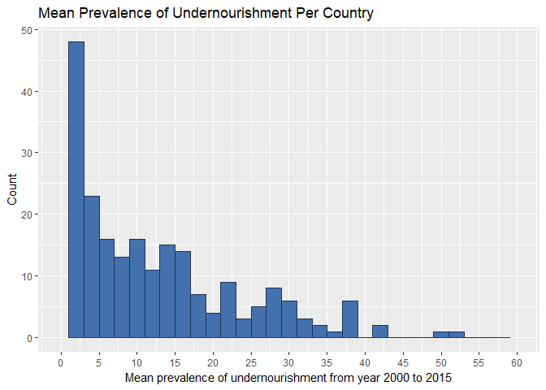
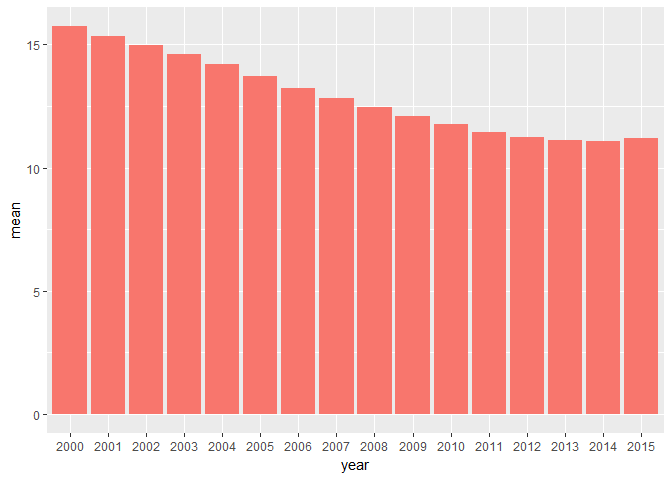

### Sustainable Development Goals: Zero Hunger 

### About the dataset

This dataset is a collection of indicators from the Word Development Indicators reorganized according to the goals and targets of the Sustainable Development Goals (SDGs).

Source: https://datacatalog.worldbank.org/dataset/sustainable-development-goals


### Analysis goals

http://www.undp.org/content/undp/en/home/sustainable-development-goals.html

The United Nations Development Program has 17 Sustainable Development Goals. One of these goals is <b>ZERO HUNGER</b>. An indicator that is present in the dataset that is related to <b>ZERO HUNGER</b> goal is `Prevalence of undernourishment (% of population)` under code `SN.ITK.DEFC.ZS`. This analysis will only focus on this indicator. 

The analysis below is based on 214 countries with complete cases from year 2000 to 2015. There are 263 distinct country names in the data set. 

This analysis will attempt to answer these questions: 

1) What is the distribution of the mean prevalence of undernourishment of the 214 countries from year 2000 to 2015? 

2) What's the trend on the mean prevalence of undernourishment from year 2000 to 2015? 

3) Which are the top 10 countries that have the highest mean prevalence of undernourishment? 


### Findings 

In this analysis, I only looked at observations with complete cases. These are countries with complete data for the indicator code SN.ITK.DEFC.ZS (prevalence of undernourishment) from year 2000 to 2015. There are 263 distinct country names in the dataset, and only 214 countries have complete cases for this indicator. 

The distribution of the mean prevalence of undernourishment for each country is unimodal and right skewed. The mean of the distribution is 12.95%, and the median is 9.49%. The standard deviation and inter quartile range is 10.92% and 14.24% respectively. The lowest value is 2.49% and the highest value is 52.93%. Please see "Step 6: Answer questions" for histogram.  

From year 2000 to 2015, there is a general steady decreasing trend in the prevalence of undernourishment except between year 2014 and 2015. The overall mean prevalence went from 11.07% in 2014 to 11.21% to 2015. Overall, the prevalence dropped from 15.74% in 2000 to 11.21% in 2015. Please see "Step 6: Answer questions" for bar plot that demonstrate steady decrease. 

The top 10 countries that have the highest mean prevalence of undernourishment are below. 

|country_name              |     mean|
|:-------------------------|--------:|
|Haiti                     | 52.93125|
|Zambia                    | 49.75000|
|Central African Republic  | 41.49375|
|Rwanda                    | 41.18750|
|Liberia                   | 39.00000|
|Korea, Dem. People's Rep. | 38.85625|
|Zimbabwe                  | 38.83750|
|Chad                      | 38.71875|
|Tajikistan                | 38.53125|
|Ethiopia                  | 37.40625|
 
 
### Load libraries

```r
rm(list=ls())

library(dplyr)
library(tidyr)
library(knitr)
library(ggplot2)
library(stringr)
```


### Step 1: Load data set 

There is an extra column that is blank that gets read as a column because every row of the source file ends in a comma. This blank column by default is assigned the name "X". I am going to drop this column. 


```r
fileSource = "https://raw.githubusercontent.com/Shetura36/Data-607-Assignments/master/Project2/SDGData.csv"

sdg_data = read.table(fileSource, header=TRUE, sep=",", na.strings = c("", "NA"))
sdg_data$X <- NULL
```

### Step 2: Rename some columns and list distinct country names. 

This file has 91,524 observations and 32 variables. The names of the year columns (from 1990 to 2017) was automatically renamed when the "read.table" function was called by adding an "X" in front of the year so that the name follows the variable naming rules of R.  

There are 263 distinct country names.

Although the data file uses the column name `Country Name`, a review of the first few rows of the data shows that some of the observations are not really countries. Some are geographic groups or a grouping of countries or regions based on some unifying criteria. For example, `Heavily indebted poor countries (HIPC)` is listed as a country name. 

Below is a preview of the first 10 countries in the dataset. 


```r
names(sdg_data)[1] <- "country_name"
names(sdg_data)[2] <- "country_code"
names(sdg_data)[3] <- "indicator_name"
names(sdg_data)[4] <- "indicator_code"

#Count of distinct country names
sdg_data %>% dplyr::select(country_name) %>% dplyr::n_distinct()
```

```
## [1] 263
```

```r
#Display all 263 countries
countries <- unlist(sdg_data %>% dplyr::select(country_name) %>% dplyr::distinct())
names(countries) <- NULL
rownames(countries) <- c()
kable(head(countries, 10), format="markdown")
```


|x                                             |
|:---------------------------------------------|
|Arab World                                    |
|Caribbean small states                        |
|Central Europe and the Baltics                |
|Early-demographic dividend                    |
|East Asia & Pacific                           |
|East Asia & Pacific (excluding high income)   |
|East Asia & Pacific (IDA & IBRD)              |
|Euro area                                     |
|Europe & Central Asia                         |
|Europe & Central Asia (excluding high income) |

### Step 3: Create a subset for indicator `Prevalence of undernourishment (% of population)` under code `SN.ITK.DEFC.ZS` 

In this analysis, I will only focus on this particular indicator. So there is no need to include the other indicators when I'm doing my data transformation and analysis. After reviewing the data specifically for this indicator, I noticed that there are no data reported for this indicator earlier than 2000, and most do not have data for years 2016 and 2017. So, I am going to exclude data before 2000 and after 2015. In addition, I am only going to include complete cases. 

There are 263 observations with indicator code ```SN.ITK.DEFC.ZS```. This matches the number of distinct country names in the data set. 

There are 214 observations with complete cases with indicate code ```SN.ITK.DEFC.ZS```. These are observations with values for this specific indicator from 2000 to 2015. 

Below you will see a preview of the first few rows of this dataset. 


```r
#filter only for this specific indicator
sdg_target <- sdg_data %>% dplyr::filter(sdg_data$indicator_code == "SN.ITK.DEFC.ZS")

#remove year columns that we will be excluding
sdg_target$X1990 <- NULL
sdg_target$X1991 <- NULL
sdg_target$X1992 <- NULL
sdg_target$X1993 <- NULL
sdg_target$X1994 <- NULL
sdg_target$X1995 <- NULL
sdg_target$X1996 <- NULL
sdg_target$X1997 <- NULL
sdg_target$X1998 <- NULL
sdg_target$X1999 <- NULL
sdg_target$X2016 <- NULL
sdg_target$X2017 <- NULL

kable(head(sdg_target), format="markdown")
```


|country_name                                |country_code |indicator_name                                   |indicator_code |     X2000|     X2001|     X2002|     X2003|     X2004|     X2005|     X2006|     X2007|     X2008|     X2009|     X2010|     X2011|     X2012|     X2013|     X2014|     X2015|
|:-------------------------------------------|:------------|:------------------------------------------------|:--------------|---------:|---------:|---------:|---------:|---------:|---------:|---------:|---------:|---------:|---------:|---------:|---------:|---------:|---------:|---------:|---------:|
|Arab World                                  |ARB          |Prevalence of undernourishment (% of population) |SN.ITK.DEFC.ZS | 11.006685| 10.800037| 10.750254| 10.864136| 10.889482| 10.852230| 10.704332| 10.502210| 10.255657|  9.914639|  9.546829|  9.184773| 10.753860| 10.638044| 10.690561| 11.033346|
|Caribbean small states                      |CSS          |Prevalence of undernourishment (% of population) |SN.ITK.DEFC.ZS |  9.534614|  9.139948|  9.092498|  9.197996|  9.294974|  9.267623|  9.354930|  9.436961|  9.654752|  9.718647|  9.718363|  9.541144|  9.307820|  9.119894|  8.767809|  8.165319|
|Central Europe and the Baltics              |CEB          |Prevalence of undernourishment (% of population) |SN.ITK.DEFC.ZS |  3.276725|  3.212357|  3.156180|  3.094477|  3.041480|  3.014206|  2.977833|  2.946710|  2.887403|  2.845115|  2.812127|  2.794134|  2.758865|  2.700812|  2.635164|  2.594080|
|Early-demographic dividend                  |EAR          |Prevalence of undernourishment (% of population) |SN.ITK.DEFC.ZS | 18.039847| 18.309765| 18.840083| 19.059130| 18.925899| 18.231001| 17.209325| 16.159562| 15.343915| 14.728337| 14.269825| 13.898946| 13.648504| 13.423871| 13.214779| 13.160030|
|East Asia & Pacific                         |EAS          |Prevalence of undernourishment (% of population) |SN.ITK.DEFC.ZS | 16.200267| 15.992167| 15.763762| 15.501331| 15.250795| 14.910422| 14.473858| 13.835877| 13.162601| 12.329960| 11.490907| 10.802951| 10.284989|  9.828367|  9.465963|  9.419824|
|East Asia & Pacific (excluding high income) |EAP          |Prevalence of undernourishment (% of population) |SN.ITK.DEFC.ZS | 17.896593| 17.646537| 17.378148| 17.071802| 16.778915| 16.386061| 15.885436| 15.160184| 14.397826| 13.465463| 12.514725| 11.741043| 11.159926| 10.650169| 10.246616| 10.201218|

```r
# 263 observations and 20 variables
dim(sdg_target)
```

```
## [1] 263  20
```

```r
# Only keep complete cases
sdg_target <- sdg_target[complete.cases(sdg_target), ]

# There are 214 observations with complete cases 
dim(sdg_target)
```

```
## [1] 214  20
```

### Step 4: Transform subset

This subset has the columns country_name, country_code, indicator_name, indicator_code, and column years starting from X2000 all the way through X2015. 

I am going to use tidyr to transform all the year columns into a single year column so that every observation will have the columns country_name, country_code, indicator_name, indicator_code, and year. The column names of each "year" column will become values on the new `year` column. 

The `tidyr::gather` function will accomplish this. 

As a result of this transformation, I no longer need 2 columns: `indicator_name`, and `indicator_code`. I am going to drop these 2 columns from the data frame. 

Below you will see a preview of the first few rows of the transformed dataset. 


```r
sdg_target_transform1 <- tidyr::gather(sdg_target, "year", "undernourishment_SN.ITK.DEFC.ZS", 5:20)

sdg_target_transform1$indicator_code <- NULL
sdg_target_transform1$indicator_name <- NULL

sdg_target <- sdg_target_transform1
sdg_target_transform1 <- NULL

kable(head(sdg_target), format="markdown")
```


|country_name                                |country_code |year  | undernourishment_SN.ITK.DEFC.ZS|
|:-------------------------------------------|:------------|:-----|-------------------------------:|
|Arab World                                  |ARB          |X2000 |                       11.006685|
|Caribbean small states                      |CSS          |X2000 |                        9.534614|
|Central Europe and the Baltics              |CEB          |X2000 |                        3.276725|
|Early-demographic dividend                  |EAR          |X2000 |                       18.039847|
|East Asia & Pacific                         |EAS          |X2000 |                       16.200267|
|East Asia & Pacific (excluding high income) |EAP          |X2000 |                       17.896593|

### Step 5: Calculate summary data

In this step, we calculate the mean prevalence of undernourishment for each country from year 2000 to 2015. In addition, we also calculate the mean for all countries for each year from 2000 to 2015. 


```r
sdg_meanPerCountry <-
  sdg_target %>% 
    dplyr::group_by(country_name) %>%  
    dplyr::summarise(country_mean = mean(undernourishment_SN.ITK.DEFC.ZS))

names(sdg_meanPerCountry)[1] <- "country_name"

sdg_meanPerYear <-
  sdg_target %>% 
  dplyr::group_by(year) %>% 
  dplyr::summarise(mean = mean(undernourishment_SN.ITK.DEFC.ZS))

#rename the years to remove the "X" in front
for (i in 1:nrow(sdg_meanPerYear)) {
  sdg_meanPerYear[i,1] <- stringr::str_extract(sdg_meanPerYear[i,1], "[0-9]{4,4}")
}
```

### Step 6: Answer questions

#### 1) What is the distribution of the mean prevalence of undernourishment of the 214 countries from year 2000 to 2015? 

In the histogram below, you will see that the distribution is unimodal and skewed to the right. It does not appear to be normally distributed. 

Below is a preview of the mean prevalence of undernourishment of the first 10 countries.

Summary statistics for the mean prevalence.

* min: 2.49%
* max: 52.93%
* mean: 12.95%
* median: 9.49%
* IQR: 14.24%
* sd: 10.92%


```r
kable(head(sdg_meanPerCountry, 10), format="markdown")
```


|country_name        | country_mean|
|:-------------------|------------:|
|Afghanistan         |     30.47500|
|Albania             |      8.18125|
|Algeria             |      7.46250|
|Angola              |     27.72500|
|Antigua and Barbuda |     31.70000|
|Arab World          |     10.52419|
|Argentina           |      4.16875|
|Armenia             |      9.71250|
|Australia           |      2.50000|
|Austria             |      2.50000|

```r
unlist(sdg_meanPerCountry %>% dplyr::summarise(mean=mean(country_mean), 
                                median=median(country_mean),
                                IQR = IQR(country_mean),
                                sd = sd(country_mean),
                                min = min(country_mean),
                                max = max(country_mean)))
```

```
##      mean    median       IQR        sd       min       max 
## 12.945129  9.492923 14.246875 10.920664  2.493750 52.931250
```

```r
barfill <- "#4271AE"
barlines <- "#1F3552"

hist <- ggplot(sdg_meanPerCountry, aes(x = country_mean)) +
        geom_histogram(aes(y = ..count..), binwidth = 2,
                       colour = barlines, fill = barfill) +
        scale_x_continuous(name = "Mean prevalence of undernourishment from year 2000 to 2015",
                           breaks = seq(0, 60, 5),
                           limits=c(0, 60)) +
        scale_y_continuous(name = "Count") +
        ggtitle("Mean Prevalence of Undernourishment Per Country")
hist
```

<!-- -->


#### 2) What's the trend on the mean prevalence of undernourishment from year 2000 to 2015? 

In the bar plot below, you will see that there has been a steady decline in the mean prevalence of undernourishment from 2000 to 2015. So far there's a drop in the mean every year except from year 2014 to 2015. The mean increased from 11.07% to 11.21%. Overall, there's a drop from 15.74% (2000) to 11.21% (2015). This is a drop of 4.53% between 2000 and 2015. 


```r
kable(sdg_meanPerYear, format="markdown")
```


|year |     mean|
|:----|--------:|
|2000 | 15.74297|
|2001 | 15.33509|
|2002 | 14.99952|
|2003 | 14.62537|
|2004 | 14.19497|
|2005 | 13.71422|
|2006 | 13.24642|
|2007 | 12.81384|
|2008 | 12.44416|
|2009 | 12.09469|
|2010 | 11.76485|
|2011 | 11.46321|
|2012 | 11.26408|
|2013 | 11.13222|
|2014 | 11.07496|
|2015 | 11.21148|

```r
ggplot() + geom_bar(aes(y = mean, x = year, fill = "#FF6666"), data = sdg_meanPerYear, stat = "identity") + guides(fill=FALSE)
```

<!-- -->

#### 3) Which are the top 10 countries that have the highest mean prevelance of undernourishment? 

Below are the top 10 countries that have the highest mean prevalence of undernourishment. 


```r
kable(head(sdg_meanPerCountry %>% dplyr::arrange(desc(country_mean)),10), format="markdown")
```


|country_name              | country_mean|
|:-------------------------|------------:|
|Haiti                     |     52.93125|
|Zambia                    |     49.75000|
|Central African Republic  |     41.49375|
|Rwanda                    |     41.18750|
|Liberia                   |     39.00000|
|Korea, Dem. People's Rep. |     38.85625|
|Zimbabwe                  |     38.83750|
|Chad                      |     38.71875|
|Tajikistan                |     38.53125|
|Ethiopia                  |     37.40625|

