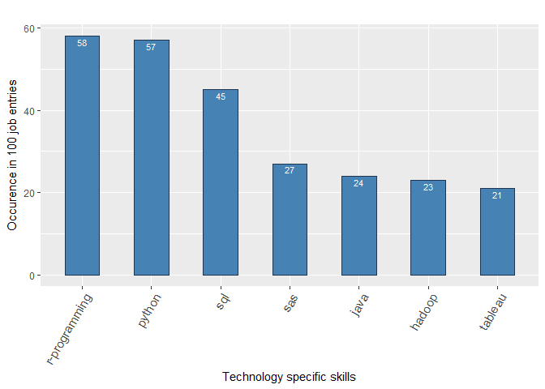
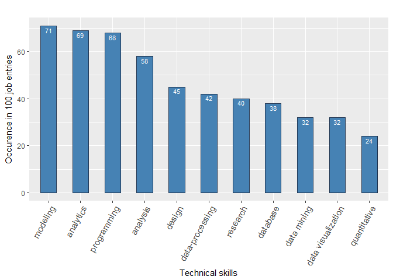
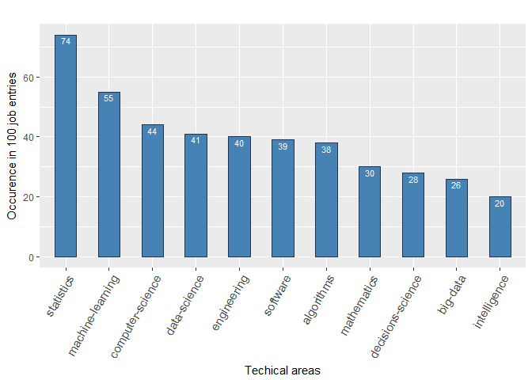
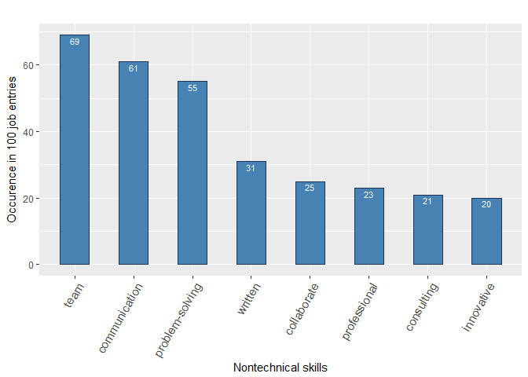

### Data 607: Project 3 

> W. Edwards Deming said, "In God we trust, all others must bring data." Please use data to answer the question, "Which are the most valued data science skills?" Consider your work as an exploration; there is not necessarily a "right answer."

---------------

### Active Members

* AHM Shahparan
* Alejandro Osborne 
* Brian Liles
* Harpeet Shoker
* Sherranette Tinapunan

---------------

### Files

* List of 100 job URLs: <br/>
https://github.com/Shetura36/Data-607-Assignments/blob/master/Project3/100Jobs-Shahparan-Version2.csv 

* Job posting text files (scrapped form the web): <br/>
https://github.com/Shetura36/Data-607-Assignments/tree/master/Project3/Jobposting-Archive

* List of term substitution: <br/>
https://raw.githubusercontent.com/Shetura36/Data-607-Assignments/master/Project3/TermsSubstitution_Shahparan-Version5.csv

* List of words removed: <br/>
https://github.com/Shetura36/Data-607-Assignments/blob/master/Project3/RemoveTerms-Score20andHigher-Version3.csv

* Term Frequency output: <br/>
https://github.com/Shetura36/Data-607-Assignments/blob/master/Project3/TermFrequency_adjusted_10.csv

* Term Selection file: <br/>
https://raw.githubusercontent.com/Shetura36/Data-607-Assignments/master/Project3/Selected_Terms_version1.csv


---------------

### Load libraries


```r
library(rvest)
library(knitr)
library(tm)
library(stringr)
library(dplyr)
library(ggplot2)
```

---------------

## Web scraping

### Load job posting URLs

The job URL file contains 100 entries. It has three columns: row_id, job_url, and selector. 
The `selector` column store the selector item as determined by `selectorgadget` tool.


```r
#setwd("C:/Users/stina/Documents/GitHub/Data-607-Assignments/Project3")

url_source <- 
  "https://raw.githubusercontent.com/Shetura36/Data-607-Assignments/master/Project3/100Jobs-Shahparan-Version2.csv"

#load the list of URLs
url_listing <- data.frame(read.csv(url_source, header=TRUE, sep=",", stringsAsFactors = FALSE, row.names = NULL))
```

### Preview of URL list

|   | row_id|job_url                                                                                                                                                |selector        |
|:--|------:|:------------------------------------------------------------------------------------------------------------------------------------------------------|:---------------|
|12 |     12|https://job-openings.monster.com/Sr-Lead-Data-Scientist-Tampa-FL-US-Altamira-Technologies-Corporation/11/192729170                                     |#JobDescription |
|13 |     13|https://job-openings.monster.com/Data-Scientist-Richardson-TX-US-Agile-Global-Solutions-Inc/11/193663693                                               |#JobDescription |
|14 |     14|https://www.careerbuilder.com/job/J3W0FK77V5KXTT5PRLB?ipath=JRG8&keywords=data+scientist&searchid=547864f5-f3fc-408f-98a2-e4c8dc43c24b&siteid=ns_us_g  |.item           |
|15 |     15|https://job-openings.monster.com/CONTRACT-Data-Scientist-NTD-Job-Number-180000000E-Redmond-WA-US-Nintendo/22/7450a4af-ac1f-425b-9f2e-15aa91d0d2bd      |#JobDescription |
|16 |     16|https://job-openings.monster.com/ML-Developer-Data-Scientist-recent-MS-grad-Reston-VA-US-Ellucian-Inc/22/0144a31f-51d1-4d6a-870f-d3c1d4a5fd3a          |#JobDescription |
|17 |     17|https://www.careerbuilder.com/job/J3W45Q69GSRMKLZCYXZ?ipath=JRG5&keywords=data+scientist&searchid=547864f5-f3fc-408f-98a2-e4c8dc43c24b&siteid=ns_us_g  |.item           |
|18 |     18|https://www.careerbuilder.com/job/J3P5F66QNCMTV5VTRFP?ipath=JRG10&keywords=data+scientist&searchid=547864f5-f3fc-408f-98a2-e4c8dc43c24b&siteid=ns_us_g |.item           |

---------------

### Extract and save the job posting

While manually stepping through each URL to confirm that the selector grabs data from each page, I noticed that some of the URLs started to expire. In addition, there was a post in the class slack channel about being banned from a job site. So while going through the the step by step check, a line of code saved each extracted data to a text file just in case the posting expires or access gets denied. However, when an attempt was made to run the entire for loop to go through the 100 URLs to automatically build the dataset of job postings, Monster.com had already blocked access to the site. 

Most of the job postings are from Monster.com and a few are from Indeed.com.  


A team member identified a fix to both issues mentioned above. 

The try-catch block allows the loop to continue onto the next url when a page expires and returns a 404 error. 

To prevent access from being denied, a delay of 10 seconds was added with every retrieval. The code below has been updated with these fixes, and it can slowly build the list of job postings by looping through each url. 

This portion of the code has been commented out because this will take at least around 16 to 20 minutes to rebuild the job posting repository. We already have the job postings archived, and there is no need to re-run this code every time. 


```r
#setwd("./JobpostingText")

#for (i in 1:nrow(url_listing)){
#  delayedAssign("do.next", {next})
#  tryCatch(
#    read_html(url_listing$job_url[i]) %>% 
#      html_nodes(url_listing$selector[i]) %>% html_text() -> data ,
#    error = function(e){do.next}
#  )
#    filename <- paste("job", i, ".txt")
#    fileConn<-file(filename)
#    writeLines(c(data), fileConn)
#    close(fileConn)
#    Sys.sleep(10)
#

#setwd("../")
#}
```
--------

## Text mining and data clean up

The `tm` library is used to clean up the data and build a term document matrix. 

The code below will grab all 100 job postings under the specified directory. 

```r
cname <- "./Jobposting-Archive"
docs <- VCorpus(DirSource(cname))   
#summary(docs) 
```

### Preview the first document


```
## <<PlainTextDocument>>
## Metadata:  7
## Content:  chars: 4676
## 
## 
## 
## Job DescriptionJob Title: Associate Data ScientistLocation: Portland, OR Reports To: Manager, Data Science Come join us!  comScore is a media measurement company providing multiscreen reporting and analytics with cutting-edge technology to serve clients in the entertainment, media, retail, and advertising industries. comScore"s data science team helps design the intelligent engines that power the company"s advanced Movies & TV Everywhere measurement systems. Through our research, comScore builds projections that make the massive amount of raw data we take in from screens across the world meaningful and useful for our clients. We are currently seeking an Associate Data Scientist to add to our growing company of talented team members. If you"re hardworking and enjoy a cooperative work environment, we"re offering a place where you can work alongside talented peers on interesting, dynamic, and fun projects. We"re a small enough company that you can make a big difference here, but we"re big enough to reach a national audience.  Essential duties include: Validate, analyze, and conduct statistical analysis on data using analytical software (Excel, SQL, and SAS). Analyze and define efficient, workable solutions that support client business processes and functional requirements for research projects. Extract qualitative findings from large data sets. Write reports that include effective graphs, tables, summaries, and narratives. Develop and execute test cases to ensure data requirements have been met. Research and resolve client-reported issues. Interpret results, present findings, and recommend alternative solutions to research management and business decision makers.  Track daily industry news and disseminate relevant articles to management and teamQualifications and Required Skills: Bachelor Degree in Statistics, Decision Sciences, Economics, Physics, Mathematics, Engineering or similar field required. Experience with SQL, Python or other programming language Highly competent in data manipulation and critical thinking. Intrinsic ability to look at data and identify patterns, problems, or analysis opportunities. Knowledge of data mining and software applications. Ability to distill large amounts of information into key findings. The ability to clearly articulate research in written and verbal presentations with software developers, clients, management, and sales staff. Data management experience with one or more data analysis packages (e.g. SPSS, SAS, STATA, R) required. Experience with Excel, including pivot tables, formulae, VLOOKUP’s, and graphing Strong organizational skills including the ability to multi-task and prioritize efficiently to meet deadlines. Strong attention to detail and problem-solving skills. Self-motivated, takes initiative, loves to learn, and continuously seeks new knowledge. Strong documentation skills from both a business and technology perspective. Effective troubleshooting and investigation skills to identify root cause of problems. Proven ability to manage and perform multiple tasks under conditions of fluctuating workloads, competing requirements, and changing deadlines while maintaining accuracy; working independently and completing assignments with minimal direction. Self-starter who is self-motivated, efficient, responsible, and dependable. ADDITIONAL CONSIDERATION WILL BE GIVEN TO CANDIDATES WITH: Experience in the television/media research industry is a plus. About comScore: comScore is a leading cross-platform measurement company that measures audiences, brands and consumer behavior everywhere. comScore completed its merger with Rentrak Corporation in January 2016, to create the new model for a dynamic, cross-platform world. Built on precision and innovation, comScore’s data footprint combines proprietary digital, TV and movie intelligence with vast demographic details to quantify consumers’ multiscreen behavior at massive scale. This approach helps media companies monetize their complete audiences and allows marketers to reach these audiences more effectively. With more than 3,200 clients and a global footprint in more than 70 countries, comScore is delivering the future of measurement.  Shares of comScore stock are currently traded on the OTC Market (OTC:SCOR). For more information on comScore, please visit comscore.com. EEO Statement: We are an equal employment opportunity employer. All qualified applicants will receive consideration for employment without regard to race, color, religion, national origin, sex, disability status, sexual orientation, gender identity, age, protected veteran status or any other characteristic protected by law.  *LI-JZ1 *MSJA
```


## Data clean up

* convert to lowercase
* remove punctuation
* remove numbers
* remove unnecessary white spaces
* substitute terms  (list of terms from a file)
* remove stop words
* remove irrelevant words (list of terms from a file)

For the removal of terms that have no relevance, a pre-processing of the term document matrix was done first so we can investigate the words that are present in the dataset. The term document matrix was adjusted so that if a term is present in a document, it is only counted once. Mentioning the term more than once in a single job posting does not increase its relevance. 

A term frequency list is generated and reviewed by a team member. Only words with scores of 20 or higher were reviewed to determine their relevance. If a term has a score of 20 and we find that it isn't relevant, the term is included in a removal file, which will be used later on to remove words from the final output. 

### Convert to lowercase

```r
docs <- tm_map(docs, tolower)   
docs <- tm_map(docs, PlainTextDocument)
#inspect(docs[[1]])
```

### Remove characters in regular expression 

```r
clean.text <- function(text){
  str_replace_all(text, regex('\r\n|\n|\t|\r|,|/|<|>|\\.'), ' ')}
docs <- tm::tm_map(docs, clean.text)
docs <- tm_map(docs, PlainTextDocument)
#inspect(docs[[1]])
```

### Remove punctuation

```r
for (j in seq(docs)) {
    docs[[j]]$content <- gsub("[[:punct:][:blank:]]+", " ", docs[[j]])
}
docs <- tm_map(docs, PlainTextDocument)
#inspect(docs[[1]])
```

### Identify characters that are NOT letters

```r
content <- ""
for(i in 1:length(docs)){
  content <- paste(content, paste(as.character(docs[[i]]), collapse = " "))
}
notLetters <- unlist(str_extract_all(content, '[^A-Za-z ]'))
notLetters <- unique(unlist(strsplit(notLetters, " ")))
```

### Characters that are not letters

```
##  [1] "’" "2" "0" "1" "6" "3" "7" "8" "4" "•" "5" "9" "™" "é" "…" "—" "–"
## [18] "”" "“"
```

### Remove characters that are not letters

```r
for (j in seq(docs)) {
  for (i in 1:length(notLetters)){
    docs[[j]]$content <- gsub(notLetters[i], " ", docs[[j]])
  }
}
docs <- tm_map(docs, stripWhitespace)
#inspect(docs[[1]])
```
### Term substitution

This term substitution file was prepared by several team members.
This file serves two purpose: (1) to preserve multi-term keywords like "data-mining", and (2) to group similar terms into a more encompassing category. For example terms like decisions, decisions support, decisions tools are substituted with the term decisions-science. 

Building the terms substitution file is an iterative process that takes a good amount of effort. It requires close investigation of the top words in the term frequency output; manually going through intermediate outputs, searching for similar terms with lower scores, and making judgement calls if a term should be mapped to a more encompassing term. 

#### Preview list of terms to be substituted

```r
file <-
  "https://raw.githubusercontent.com/Shetura36/Data-607-Assignments/master/Project3/TermsSubstitution_Shahparan-Version5.csv"

terms <- 
  read.csv(file, header=TRUE, sep=",", stringsAsFactors = FALSE, row.names = NULL)

kable(head(terms,10), format="markdown")
```


|Terms                                                                                                        |Replace                |
|:------------------------------------------------------------------------------------------------------------|:----------------------|
|^descriptive analytics[ ]{1,}&#124;[ ]{1,}descriptive analytics[ ]{1,}&#124;[ ]{1,}descriptive analytics$    |descriptive-analytics  |
|^predictive analytics[ ]{1,}&#124;[ ]{1,}predictive analytics[ ]{1,}&#124;[ ]{1,}predictive analytics$       |predictive-analytics   |
|^prescriptive analytics[ ]{1,}&#124;[ ]{1,}prescriptive analytics[ ]{1,}&#124;[ ]{1,}prescriptive analytics$ |prescriptive-analytics |
|^behavioral analytics[ ]{1,}&#124;[ ]{1,}behavioral analytics[ ]{1,}&#124;[ ]{1,}behavioral analytics$       |behavioral-analytics   |
|^clickstream analytics[ ]{1,}&#124;[ ]{1,}clickstream analytics[ ]{1,}&#124;[ ]{1,}clickstream analytics$    |clickstream-analytics  |
|^data mining[ ]{1,}&#124;[ ]{1,}data mining[ ]{1,}&#124;[ ]{1,}data mining$                                  |data-mining            |
|^dark data[ ]{1,}&#124;[ ]{1,}dark data[ ]{1,}&#124;[ ]{1,}dark data$                                        |dark-data              |
|^machine learning[ ]{1,}&#124;[ ]{1,}machine learning[ ]{1,}&#124;[ ]{1,}machine learning$                   |machine-learning       |
|^neural network[ ]{1,}&#124;[ ]{1,}neural network[ ]{1,}&#124;[ ]{1,}neural network$                         |neural-network         |
|^cloud computing[ ]{1,}&#124;[ ]{1,}cloud computing[ ]{1,}&#124;[ ]{1,}cloud computing$                      |cloud-computing        |

```r
#kable(terms)
```

#### Substitute terms from terms substitution file

```r
for (j in seq(docs))
{
  #docs[[j]] <- gsub("fake news", "fake_news", docs[[j]])
  for(i in 1:nrow(terms)){
    docs[[j]] <- gsub(terms$Terms[i], 
                      paste(" ",terms$Replace[i], " "), docs[[j]], ignore.case = TRUE)
  }
}
docs <- tm_map(docs, stripWhitespace)
docs <- tm_map(docs, PlainTextDocument)
#inspect(docs[[1]])
```

### Remove stop words

```r
# For a list of the stopwords, see:   
# length(stopwords("english"))   
#stopwords("english")   
docs <- tm_map(docs, removeWords, stopwords("english"))  
docs <- tm_map(docs, stripWhitespace)
docs <- tm_map(docs, PlainTextDocument)
#inspect(docs[[1]])
```

### Removing terms with no relevance

Terms with scores of 20 or higher and were determined to have no relevance were added to a file. The code below retrieves the terms from this file and substitutes these terms with white spaces. 

```r
file <-
  "https://raw.githubusercontent.com/Shetura36/Data-607-Assignments/master/Project3/RemoveTerms-Score20andHigher-Version3.csv"

terms <- 
  read.csv(file, header=TRUE, sep=",", stringsAsFactors = FALSE, row.names = NULL)
```

#### Preview list of terms to be removed

```r
kable(head(terms,10), format="markdown")
```


|Terms                                                                       |Replace |
|:---------------------------------------------------------------------------|:-------|
|^experience[ ]{1,}&#124;[ ]{1,}experience[ ]{1,}&#124;[ ]{1,}experience$    |xyz     |
|^work[ ]{1,}&#124;[ ]{1,}work[ ]{1,}&#124;[ ]{1,}work$                      |xyz     |
|^years[ ]{1,}&#124;[ ]{1,}years[ ]{1,}&#124;[ ]{1,}years$                   |xyz     |
|^will[ ]{1,}&#124;[ ]{1,}will[ ]{1,}&#124;[ ]{1,}will$                      |xyz     |
|^business[ ]{1,}&#124;[ ]{1,}business[ ]{1,}&#124;[ ]{1,}business$          |xyz     |
|^skills[ ]{1,}&#124;[ ]{1,}skills[ ]{1,}&#124;[ ]{1,}skills$                |xyz     |
|^tools[ ]{1,}&#124;[ ]{1,}tools[ ]{1,}&#124;[ ]{1,}tools$                   |xyz     |
|^development[ ]{1,}&#124;[ ]{1,}development[ ]{1,}&#124;[ ]{1,}development$ |xyz     |
|^working[ ]{1,}&#124;[ ]{1,}working[ ]{1,}&#124;[ ]{1,}working$             |xyz     |
|^knowledge[ ]{1,}&#124;[ ]{1,}knowledge[ ]{1,}&#124;[ ]{1,}knowledge$       |xyz     |

#### Remove terms by substituting whitespace

```r
for (j in seq(docs))
{
  #docs[[j]] <- gsub("fake news", "fake_news", docs[[j]])
  for(i in 1:nrow(terms)){
    docs[[j]] <- gsub(terms$Terms[i], "  ", docs[[j]], ignore.case = TRUE)
  }
}
docs <- tm_map(docs, stripWhitespace)
docs <- tm_map(docs, PlainTextDocument)
#inspect(docs[[1]])
```

### Preview final output of first document

```r
inspect(docs[[1]])
```

```
## <<PlainTextDocument>>
## Metadata:  7
## Content:  chars: 2845
## 
## 
## 
##  descriptionjob title associate scientistlocation portland manager data-science come us comscore media measurement providing multiscreen reporting analytics cutting edge serve entertainment media retail advertising industries comscore s data-science team helps design intelligent engines power s movies tv everywhere measurement research comscore builds projections massive amount raw take screens meaningful useful currently associate add growing talented team members re hardworking enjoy cooperative re offering place alongside talented peers interesting dynamic fun re small enough big difference re big enough reach audience essential duties validate analyze conduct statistics analysis analytical software excel sql sas analyze define efficient workable functional research extract qualitative findings write effective graphs tables summaries narratives execute test cases ensure met research resolve reported issues interpret present findings recommend alternative research decisions-science makers track daily news disseminate articles teamqualifications statistics decisions-science sciences economics physics mathematics engineering similar sql python programming programming competent manipulation critical thinking intrinsic look patterns problem-solving analysis data-mining software distill amounts findings clearly articulate research written verbal presentations software developers sales staff data analysis packages e g spss sas stata r-programming excel pivot tables formulae vlookup s graphing organizational multi task prioritize efficiently meet deadlines attention detail problem-solving problem-solving self motivated takes initiative loves learn continuously seeks documentation perspective effective troubleshooting investigation root cause problem-solving proven manage tasks conditions fluctuating workloads competing changing deadlines maintaining accuracy independently completing assignments minimal direction self starter self motivated efficient responsible dependable additional consideration given candidates television media research comscore comscore cross platform measurement measures audiences brands consumer behavior everywhere comscore completed merger rentrak corporation january modeling dynamic cross platform built precision innovation comscore s footprint combines proprietary digital tv movie intelligence vast demographic details quantify consumers multiscreen behavior massive scale approach helps media companies monetize complete audiences allows marketers reach audiences effectively global footprint countries comscore future measurement shares comscore stock currently traded otc otc scor comscore visit comscore com eeo statement qualified applicants receive consideration regard race color religion origin sex sexual orientation gender identity age veteran characteristic law li jz msja
```

-------------------

## Create a term document matrix

After doing the data clean up above, below are the number of terms that remained across 100 documents. 

```r
tdm <- TermDocumentMatrix(docs) 
tdm  
```

```
## <<TermDocumentMatrix (terms: 4562, documents: 100)>>
## Non-/sparse entries: 14532/441668
## Sparsity           : 97%
## Maximal term length: 43
## Weighting          : term frequency (tf)
```

### Adjust term document matrix count

If a term is mentioned at least once in a document, it is only counted once.  Mentioning the term more than once in a single job posting does not increase its relevance.

The code below will update the count to 1 if the count is greater than 1. 

```r
#m <- as.matrix(tdms)
m <- as.matrix(tdm)

#adjust the term count so that when a term appears in a document, it is only counted once
for(i in 1:nrow(m)){
  for(j in 1:ncol(m)){
    if(m[i,j]>1){
      m[i,j] <- 1
    }
  }
}
```

### Create the term frequency list

The code below sums the count across all 100 documents for each term. 
This will assign a frequency score for each term. 

If a term has a score of 20, it means that the term was mentioned at least once in 20 different documents.


```r
freq <- rowSums(m)
termFreq <- cbind(names(freq),freq)
rownames(termFreq) <- NULL
colnames(termFreq) <- c("term", "frequency")
termFreq <- data.frame(termFreq, stringsAsFactors = FALSE)
termFreq$frequency <- as.numeric(termFreq$frequency)
```

### Terms with frequency scores of 20 and higher

|term               | frequency|
|:------------------|---------:|
|statistics         |        74|
|modeling           |        71|
|analytics          |        69|
|team               |        69|
|programming        |        68|
|communication      |        61|
|analysis           |        58|
|r-programming      |        58|
|python             |        57|
|machine-learning   |        55|
|problem-solving    |        55|
|design             |        45|
|sql                |        45|
|computer-science   |        44|
|analytical         |        43|
|data-processing    |        42|
|data-science       |        41|
|engineering        |        40|
|research           |        40|
|software           |        39|
|algorithms         |        38|
|database           |        38|
|data-mining        |        32|
|data-visualization |        32|
|written            |        31|
|mathematics        |        30|
|decisions-science  |        28|
|sas                |        27|
|big-data           |        26|
|analyze            |        25|
|collaborate        |        25|
|java               |        24|
|quantitative       |        24|
|hadoop             |        23|
|professional       |        23|
|consulting         |        21|
|tableau            |        21|
|innovative         |        20|
|intelligence       |        20|

### Write the term frequency to a file

```r
result <- 
  termFreq %>% dplyr::select(term, frequency) %>% dplyr::arrange(desc(frequency))
#write.csv(m, file="TermDocumentMatrix_adjusted.csv") 
write.csv(result, file="TermFrequency_adjusted_10.csv")
```

--------------

### Visual Presentation

A team member analyzed the terms with scores of 20 or higher, and assigned the terms into four different categories: technical skills, technology specific skills, general technical areas, and nontechnical skills. 

This data is quite telling as it shows even though hard technical skills are crucial, soft skills are as important. The need for team work and communication are quite high on the list of competencies that are being searched for by recruiting teams.


------

<!-- -->


<!-- -->


<!-- -->

<!-- -->


        
--------

